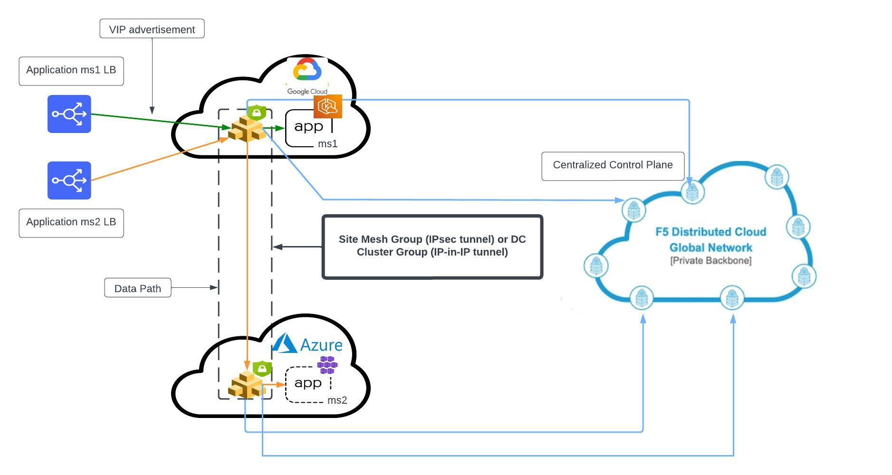
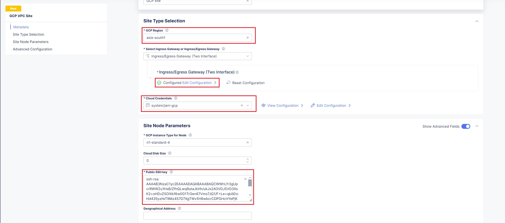
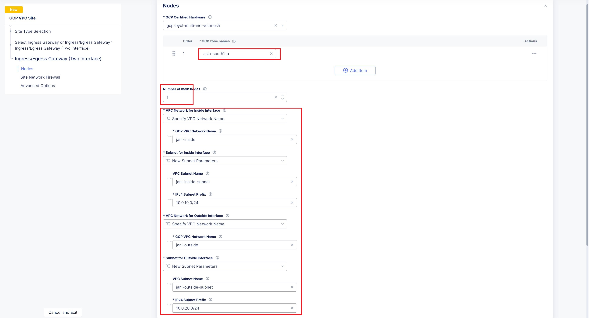

Manual step by step process for the deployment
===============================================

Prerequisites
**************
- Access to GCP & Azure portals - If you do not have accounts, get in touch with cloud support for portal access
- Access to F5 XC account - Contact F5 Support if you do not have one
- Cloud credentials onboarded in F5 XC - Check `GCP article <https://community.f5.com/kb/technicalarticles/creating-a-credential-in-f5-distributed-cloud-for-gcp/298290>`_ and `Azure article <https://community.f5.com/kb/technicalarticles/creating-a-credential-in-f5-distributed-cloud-for-azure/298316>`_ for more details
- SSH key pair - check `GCP doc <https://cloud.google.com/compute/docs/connect/create-ssh-keys>`_ for key pair generation

Deployment Steps
*****************
1. Create VPC in GPC portal
    i. Login to GCP portal and search VPC service, select it 
    ii. Click create VPC 
    iii. Enter VPC name, IPv4 VPC CIDR block and click create
    NOTE: Since MCN-without-SMG folder already showcased use case of adding CE site on existing infra, here we will create all infra details like VPC, subnets, etc from F5 XC console

2. Create a GCP VPC site
    i. Login to F5 XC Console 
    ii. Select Manage > Site Management > GCP VPC Sites in the configuration menu. Click on Add GCP VPC Site. 
    iii. Enter a name and description for your VPC site 
    iv. Configure “Site Type Selection” section:
          a. Select GCP region and cloud credentials from drop-down
          b. Select Ingress/Egress Gateway (Two Interface) option for the Select Ingress Gateway or Ingress/Egress Gateway field. 
          e. Click configure, add AZ and subnet IDs for workload, inside and outside subnets. Apply the configuration. 
          f. Add a public ssh key in Site Node Parameters section 
          g. Toggle Show Advanced Fields button for Advanced Configuration section then select “Allow access to DNS, SSH services on Site” for Services to be blocked on site field, Save and Exit. Click Apply. 
          Note: It will take 15-20 mins for the site to come online. You can monitor your site health score by navigating to Home > Multi-Cloud Network Connect > Overview > Sites

3. Create a 1-node EKS cluster and deploy /shared/booksinfo/mcn-bookinfo/product_page.yaml product page microservice to it. 
    i. In GCP console, search for EKS service and select it. 
    ii. Click on create cluster button 
    iii. Enter a name, select a k8s version, select a role (To create a new role follow the `instructions <https://docs.aws.amazon.com/eks/latest/userguide/service_IAM_role.html#create-service-role>`_ ), keep rest option as default and click next button 
    iv. Select VPC created in Step1 
    v. Choose 2 subnets created in Step1 for workload 
    vi. Optionally, reuse the security group created for the AWS CE site. NOTE: make sure nodeport range [30000-32767] are open in VPC firewall rules 
    vii. Select “Public and private” option for Cluster endpoint access 
    viii. Keeping rest values as default, press next buttons. Finally, review the configs and click on create button  
    ix. Once EKS cluster is up, select it and navigate to Compute section and click Add node group 
    x. Enter a name, select a role (if not created, create it and assign. Follow `document <https://docs.aws.amazon.com/eks/latest/userguide/create-node-role.html>`_ for more info) 
    xi. Set compute and scaling configurations, here we are creating a 1 node EKS cluster 
    xii. Select the workload subnet for your worker node 
    xiii. Keep rest options default, review the config done and create the node group 
    xiv. In GCP portal, open cloud shell and connect to above created cluster
    xv. Open a file with name product.yaml and paste contents of /shared/booksinfo/mcn-bookinfo/product_page.yaml 
    xvi. Run "kubectl apply -f product.yaml” and validate product service is deployed and running using "kubectl get pods" & "kubectl get svc" commands
**Note:** Here, we are using product page service type as NodePort 

.. figure:: assets/Capture1.JPG

4. Create a HTTP Load Balancer (LB) pointing to the k8s cluster worker node as an origin server, enable WAF in blocking mode and advertise this LB to the AWS CE site itself. 
    i. Select Manage > Load Balancers > HTTP Load Balancers and click Add HTTP Load Balancer 
    ii. Enter a name for the new load balancer. Optionally, select a label and enter a description.
    iii. In the Domains field, enter a domain name 
    iv. From the Load Balancer Type drop-down menu, select HTTP, do not select auto manage DNS records option and port as 80
    v. Configure origin pools: 
        a. In the Origins section, click Add Item to create an origin pool. 
        b. In the origin pool field dropdown, click Add Item 
        c. Enter name, in origin server section click Add Item 
        d. Select type of origin server as “IP address of Origin Server on given Sites” 
        e. Copy/Paste the private IP of your worker node. (in GCP portal, open cloud shell and run “kubectl get node –o wide” to get the private IP of node) 
        f. Select the GCP VPC site created in step2, apply the configuration 
        g. Copy/Paste product page service port to the origin server port field (in GCP portal, open cloud shell and run “kubectl get svc” to get the port value of productpage service), apply the configuration 
        h. Enable WAF and select the WAF policy. If not created, create a basic default WAF policy in blocking mode and attach it to the LB 
        i. Scroll down to “Other Settings” section.
            -  Here, in “VIP Advertisement” select custom and add the configs to advertise only on this GCP Site shown as below
        j. Save the configurations. 

.. figure:: assets/4.JPG

**- Below steps are related to Azure configurations**.

5. Create Azure Vnet site as per below steps
      i. From the Console homepage, select "Multi-Cloud Network Connect".
      ii. Select "Manage > Site Management", select "Azure VNET Sites" and click on "Add Azure VNET Site".
      iii. Enter a name, optionally select a label and add a description.
      iv. In the Site Type Selection section: 
            a. Enter a new Azure resource group name (which doesn't exists) in the “Resource Group” field
            b. Select a region from the Recommended or Alternate Azure Region Names.
            c. Configure Vnet field by selecting "New Vnet Parameters" and fill CIDR details to create new Vnet
            d. Select Ingress/Egress Gateway (Two Interface) option for the Select Ingress Gateway or Ingress/Egress Gateway field.
            e. Create Ingress/Egress gateway by providing 1 AZ value and 2 new subnet CIDR's to be created for inside and outside interfaces
            f. Select the Azure cloud credentials created in Step 5
      v. Add a public ssh key in Site Node Parameters section created in prerequisites
      vi. Toggle Show Advanced Fields button for Advanced Configuration section then select “Allow access to DNS, SSH services on Site” for Services to be blocked on site field, Save and Exit. Click Apply. **Note:** It will take 15-20 mins for the site to come online. You can monitor your site health score by navigating to Home > Multi-Cloud Network Connect > Overview > Sites 
      vii. For more detailed explanation about Azure site creation, refer to the `document <https://docs.cloud.f5.com/docs/how-to/site-management/create-azure-site>`_

8. Create a 1-node AKS cluster and deploy `details </shared/booksinfo/mcn-bookinfo/details.yaml>`_ microservice to it 
      i. From Azure console search for “Kubernetes services”
      ii. Click on Create button and select "Create Kubernetes cluster"
      iii. Select your subscription and select the above created resource group 
      iv. Fill in the remaining cluster details and primary node pool fields as needed (select 1 node pool if workload is enough). If this is for testing select Dev/Test as part of cluster preset configuration
      v. Navigate to “Networking” tab and click on "Bring your own virtual network"
      vi. Select the Virtual network created in Step 2
      vii. Click “Review + create” and create the cluster
      viii. Once cluster is created, in Azure portal open cloud shell and connect to this cluster
      ix. Create a new file inside cloud shell and paste contents of /shared/booksinfo/mcn-bookinfo/details.yaml
      x. Run "kubectl apply -f <file-name>" to deploy details microservice
      xi. Validate details service is deployed and running using "kubectl get pods" & "kubectl get svc" commands

9. Create a HTTP Load Balancer (LB) pointing to the AKS cluster worker node as an origin server, enable WAF in blocking mode and advertise this LB as well to the GCP CE site with site network field set to inside.
    i. Select Manage > Load Balancers > HTTP Load Balancers and click Add HTTP Load Balancer 
    ii. Enter a name for the new load balancer. Optionally, select a label and enter a description.
    iii. In the Domains field, enter domain name as details 
    iv. From the 'Load Balancer Type' drop-down menu, select HTTP, do not select Manage DNS records option and set HTTP Listen Port to 9080.
    v. Configure origin pools: 
        a. In the Origins section, click Add Item to create an origin pool. 
        b. In the origin pool field dropdown, click Add Item 
        c. Enter name, in origin server section click Add Item 
        d. Select type of origin server as “IP address of Origin Server on given Sites” 
        e. Copy/Paste the private IP of your worker node. (In Azure cloud shell, you can run “kubectl get node –o wide” to get the private IP) 
        f. Select the Azure site created in step7, apply the configuration 
        g. Copy/Paste details service port to the origin server port field (In Azure cloud shell, you can run “kubectl get svc” to get the port value), apply the configuration 
        h. Enable WAF and select the WAF policy. If not created, create a default WAF policy in blocking mode and attach it to the LB 
        i. Scroll down to “Other Settings” section.
            -  Here, in “VIP Advertisement” select custom and add the configs as shown in below image
        j. Save the configurations. 

**Note: Since the details LB is advertised to GCP CE site on inside network, details page cannot be accessible directly from outside(internet). Additionally, attached WAF policies on both frontend and backend loadbalancers will help provide robust security to the application environment**

Testing: 
*********

1. Open hosts file and add GCP site IP to your HTTP productpage LB domain name

2. Open a browser and enter the public IP of the GCP CE site in the URL field

3. Uncheck the default host header value and create a custom host header with its value set to domain of product page HTTP LB 

4. Generate a GET request and validate UI content is displayed

5. Now update the URL field of postman to `http://<gcp-site-pub-ip>/productpage?u=normal`

6. Keeping the other parameters same, again send the GET request and validate details are getting displayed as below

7. Now, let's try a dummy cross-site-scripting attack as shown below

8. Monitor the security event logs from XC console

Step by step process using automation scripts
#############################################

Coming Soon...

**Support**
############

For support, please open a GitHub issue. Note, the code in this repository is community supported and is not supported by F5 Networks. 
