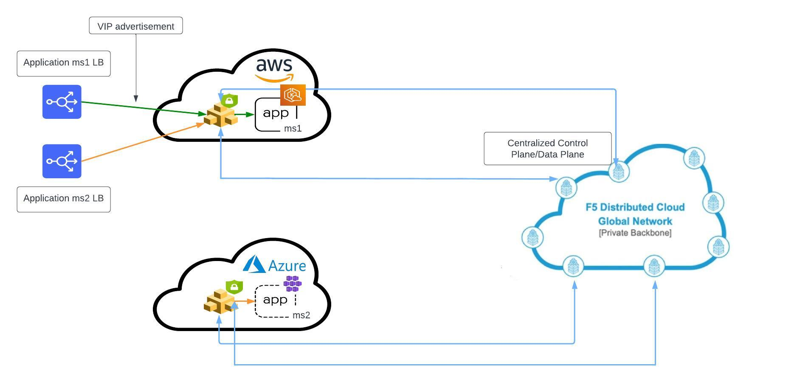

Deploying F5 XC WAF on Customer Edge (Multi-Cloud Scenario without Site Mesh Group)
=============================

--------------

.. contents:: **Table of Contents**

Overview
#########

This demo guide provides manual step-by-step walkthrough for applying WAF on CE sites deployed on different cloud platforms and establishing connectivity among them using XC console along with terraform scripts to automate this deployment. For more information on different WAAP deployment modes, refer to the devcentral article: `Deploy WAF Anywhere with F5
Distributed Cloud <https://community.f5.com/t5/technical-articles/deploy-waf-anywhere-with-f5-distributed-cloud/ta-p/313079>`__.

**Note:** Even though the scenario here focuses on XC WAF, customers can enable any security services in the same setup, such as API Security, Bot Defense, DoS/DDOS and Fraud, as per their needs.

Setup Diagram
#############

Workflow Instructions
######################

`F5 Distributed Cloud Console Workflow <./xc-console-demo-guide.rst>`__

`F5 Distributed Cloud Automation Workflow (Coming Soon)`
