Manual step by step process for the deployment
===============================================

.. figure:: assets/readme_console.jpeg

Prerequisites
**************
- Access to AWS & Azure portals
- Access to F5 XC account 
- Install AWS CLI, Azure CLI and Kubectl command line tool to connect and push the app manifest files to EKS and AKS clusters 
- Install postman for testing the setup 

Deployment Steps
*****************
1. Create Networking components in AWS like VPC and subnets 
    i. Login to AWS portal and search VPC service, select it 
    ii. Click create VPC 
    iii. Enter VPC name, IPv4 VPC CIDR block and click create 
    iv. Navigate to Subnets, Click create subnet 
    v. Select above created VPC, enter a subnet name, IPv4 Subnet CIDR block, click create.  
          - Here we are creating 4 subnets, 2 for site local outside/inside interfaces of AWS VPC Site and 2 for workloads (As EKS cluster requires 2 subnets in different Availability Zones (AZs) to be present inside the VPC) 

2. Create an AWS VPC site
    i. Login to F5 XC Console 
    ii. Select Manage > Site Management > AWS VPC Sites in the configuration menu. Click on Add AWS VPC Site. 
    iii. Enter a name for your VPC site 
    iv. Configure “Site Type Selection” section:
          a. Select AWS cloud credential XC object, if not created click on ‘add item’ button from dropdown menu and create one referring to this `DevCentral article <https://community.f5.com/kb/technicalarticles/creating-a-credential-in-f5-distributed-cloud-to-use-with-aws/298111>`_
          b. Select a region from the AWS Region drop-down field.
          c. Select Existing VPC ID option for VPC field and copy/paste the VPC ID of VPC created in step 1 
          d. Select Ingress/Egress Gateway (Two Interface) option for the Select Ingress Gateway or Ingress/Egress Gateway field. 
          e. Click configure, add AZ and subnet IDs for workload, inside and outside subnets. Apply the configuration. 
          f. Add a public ssh key in Site Node Parameters section 
          g. Toggle Show Advanced Fields button for Advanced Configuration section then select “Allow access to DNS, SSH services on Site” for Services to be blocked on site field, Save and Exit. Click Apply. Note: It will take 15-20 mins for the site to come online. You can monitor your site health score by navigating to Home > Multi-Cloud Network Connect > Overview > Sites 
          h. For more detailed information regarding AWS Site refer to the `document <https://docs.cloud.f5.com/docs/how-to/site-management/create-aws-site>`_ 

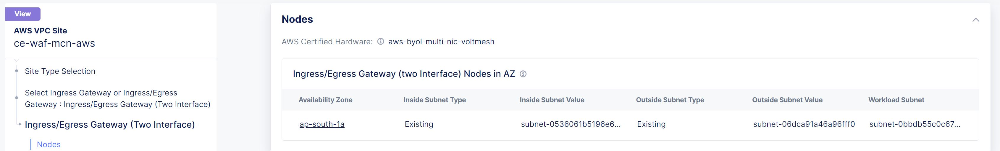

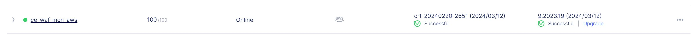

3. Create a 1-node EKS cluster and deploy `istio bookinfo <https://istio.io/latest/docs/examples/bookinfo/>`_ product page microservice to it. 
    i. In AWS console, search for EKS service and select it. 
    ii. Click on create cluster button 
    iii. Enter a name, select a k8s version, select a role (To create a new role follow the `instructions <https://docs.aws.amazon.com/eks/latest/userguide/service_IAM_role.html#create-service-role>`_ ), keep rest option as default and click next button 
    iv. Select VPC created in Step1 
    v. Choose 2 subnets created in Step1 for workload 
    vi. Optionally, reuse the security group created for the AWS CE site 
    vii. Select “Public and private” option for Cluster endpoint access 
    viii. Keeping rest values as default, press next buttons. Finally, review the configs and click on create button  
    ix. Once EKS cluster is up, select it and navigate to Compute section and click Add node group 
    x. Enter a name, select a role (if not created, create it and assign. Follow `document <https://docs.aws.amazon.com/eks/latest/userguide/create-node-role.html>`_ for more info) 
    xi. Set compute and scaling configurations, here we are creating a 1 node EKS cluster 
    xii. Select the workload subnet for your worker node 
    xiii. Keep rest options default, review the config done and create the node group 
    xiv. Deploy the product page microservice using the kubectl command. “kubectl apply -f product.yaml” 
**Note:** Here, we are using product page service type as NodePort 

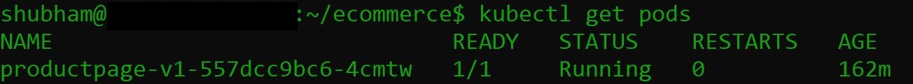

4. Create a HTTP Load Balancer (LB) pointing to the EKS cluster worker node as an origin server, enable WAF in blocking mode and advertise this LB to the AWS CE site itself. 
    i. Select Manage > Load Balancers > HTTP Load Balancers and click Add HTTP Load Balancer 
    ii. Enter a name for the new load balancer. Optionally, select a label and enter a description.
    iii. In the Domains field, enter a domain name 
    iv. From the Load Balancer Type drop-down menu, select HTTP 
    v. Configure origin pools: 
        a. In the Origins section, click Add Item to create an origin pool. 
        b. In the origin pool field dropdown, click Add Item 
        c. Enter name, in origin server section click Add Item 
        d. Select type of origin server as “IP address of Origin Server on given Sites” 
        e. Copy/Paste the private IP of your worker node. (You can use kubectl command as well “kubectl get node –o wide” to get the private IP) 
        f. Select the AWS site created in step2, apply the configuration 
        g. Copy/Paste product page service port to the origin server port field (Range [30000-32767], use kubectl command “kubectl get svc” to get the port value), apply the configuration 
        h. Enable WAF and select the WAF policy. If not created, create a WAF policy in blocking mode and attach it to the LB 
        i. Scroll down to “Other Settings” section.
            -  Here, in “VIP Advertisement” select custom and add the configs as shown in below image
        j. Save the configurations. 

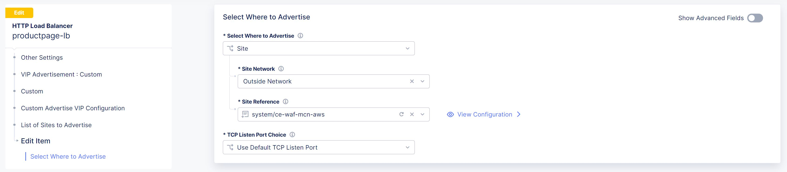

**- Below steps are related to Azure configurations which is almost already covered in the** `Azure workflow guide <https://github.com/f5devcentral/f5-xc-terraform-examples/blob/main/workflow-guides/waf/f5-xc-waf-on-ce/azure/xc-console-demo-guide.rst>`_. **Make sure to follow this linked workflow guide and do the required changes as per the steps mentioned below**.

5. Create Resource group, Vnet, Subnets in Azure 

6. Create Azure Vnet site **{Select Ingress/Egress Gateway (Two Interface) option}**

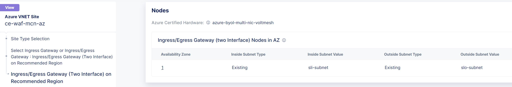

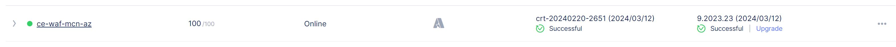

7. Create a 1-node AKS cluster and deploy `istio bookinfo <https://istio.io/latest/docs/examples/bookinfo/>`_ details microservice to it 

.. figure:: assets/Capture2.JPG

8. Create a HTTP Load Balancer (LB) pointing to the AKS cluster worker node as an origin server, enable WAF in blocking mode and advertise this LB as well to the AWS CE site with network set to inside as shown in the below image: 

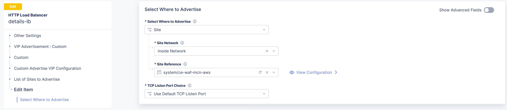

**Note: Since the details LB is advertised to AWS CE site on inside network, details page cannot be accessible directly from outside(internet). Additionally, attached WAF policies on both frontend and backend loadbalancers will help provide robust security to the application environment**

Testing: 
*********

1. Open postman 

2. Enter the public IP of the AWS CE site in the URL field

3. Uncheck the default host header value and create a custom host header with its value set to domain of product page HTTP LB 

4. Generate a GET request and monitor the request logs of product page LB from F5 XC UI dashboard 

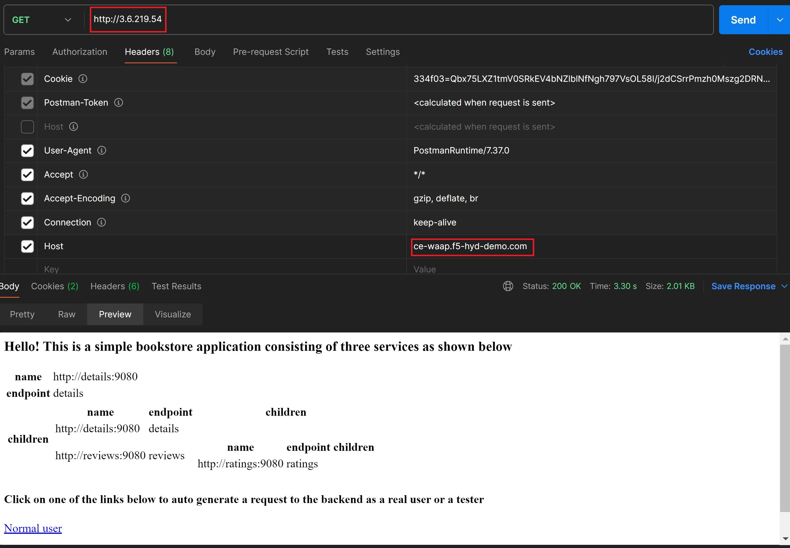

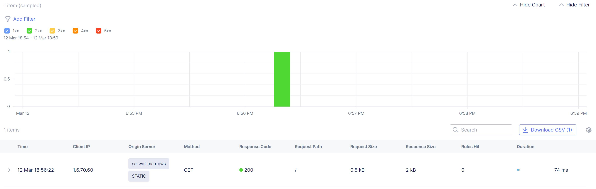

5. Now update the URL field of postman with `http://<aws-site-pub-ip>/productpage?u=normal`

6. Keeping the other parameters same, again send the GET request

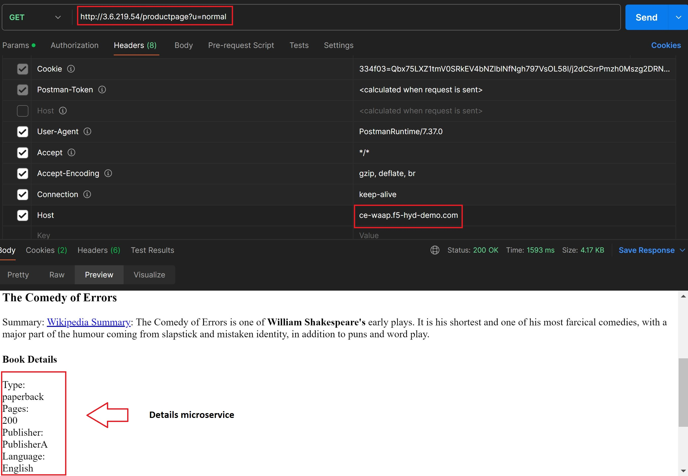

7. Now monitor the request logs of product page and details LB from F5 XC UI dashboard. 

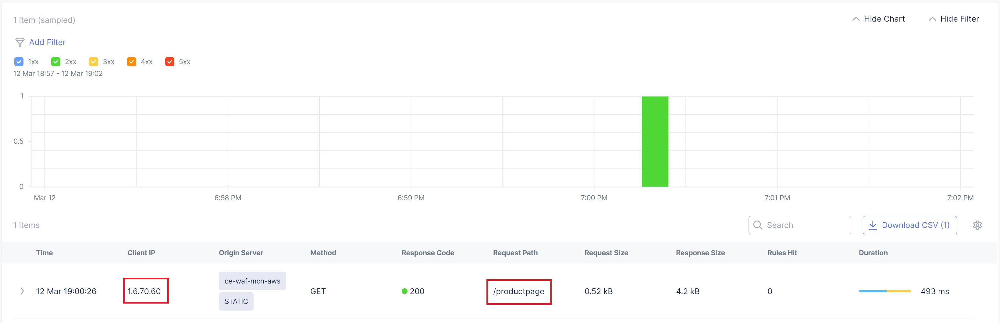

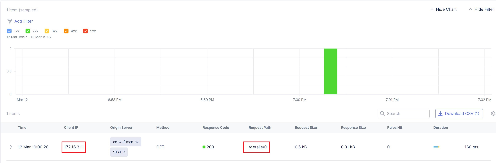

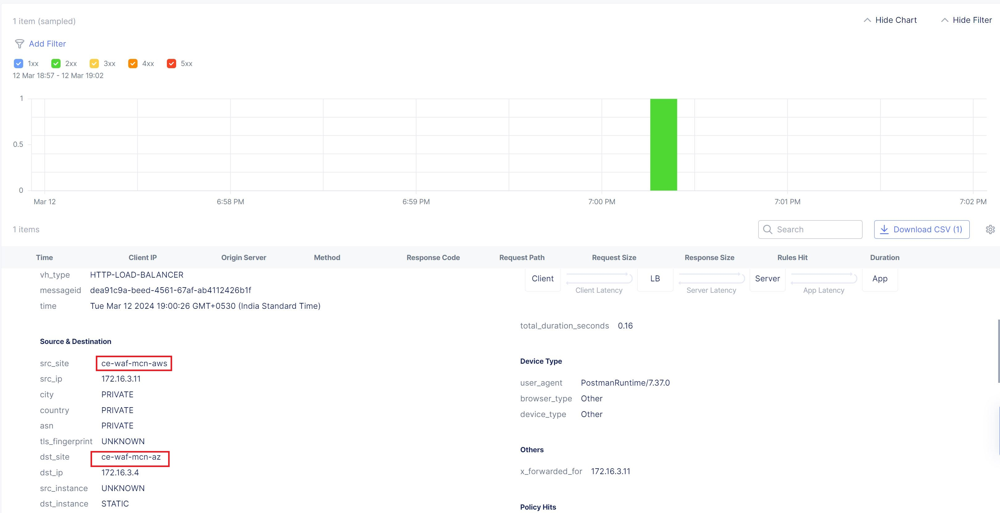

8. Now, let's try a dummy cross-site-scripting attack

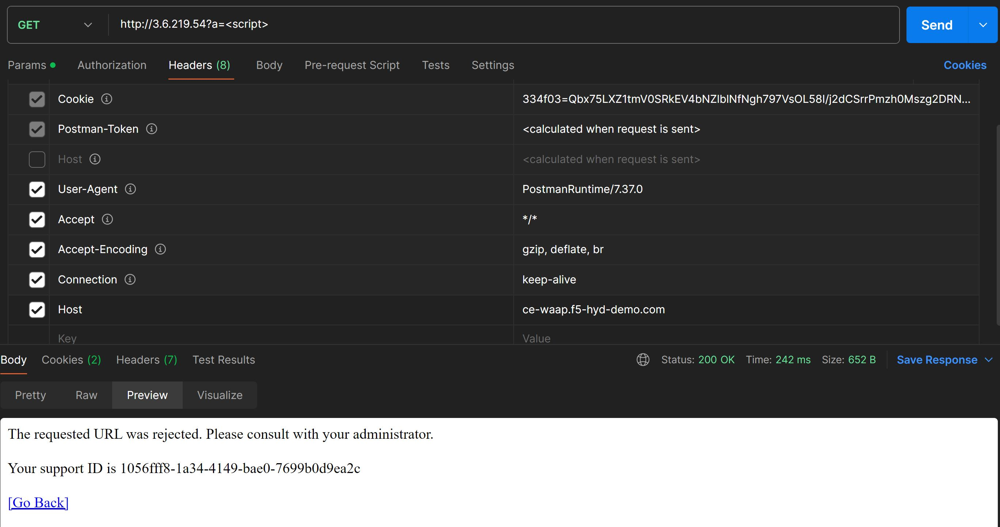

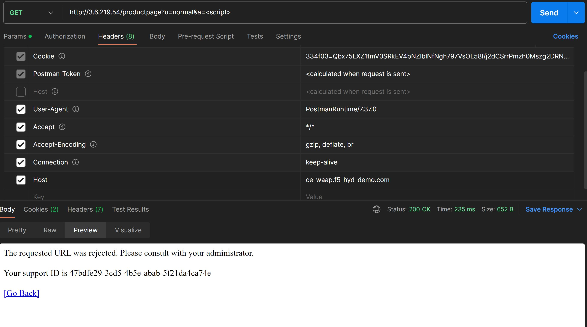

9. Monitor the security event logs from XC console

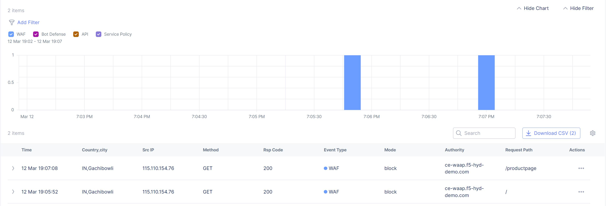

Step by step process using automation scripts
#############################################

Coming Soon...

**Support**
############

For support, please open a GitHub issue. Note, the code in this repository is community supported and is not supported by F5 Networks. 
