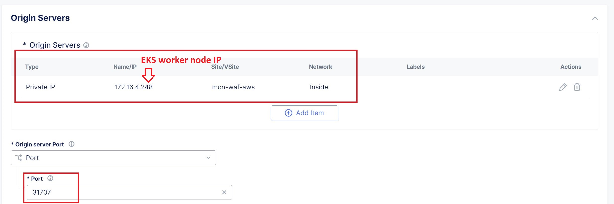
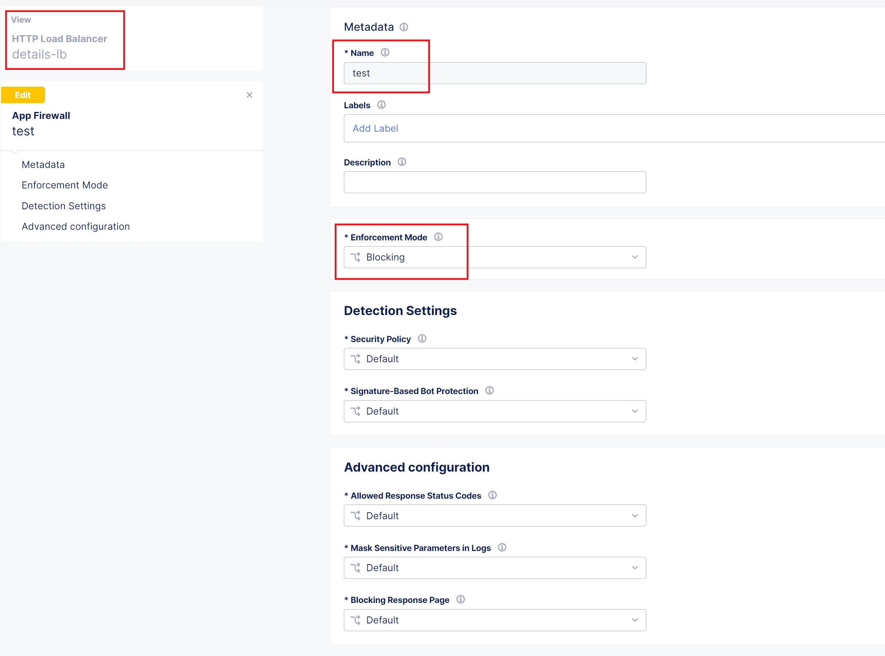
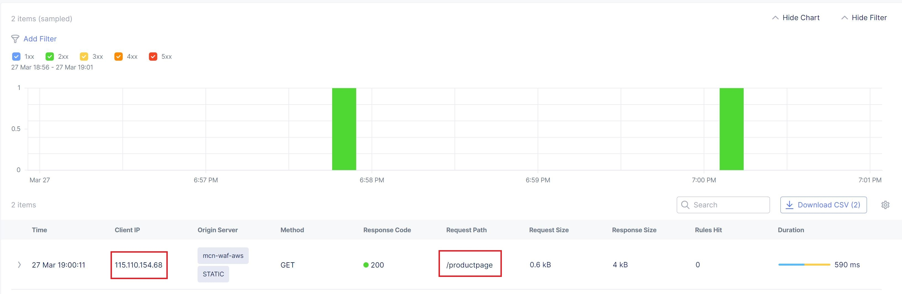
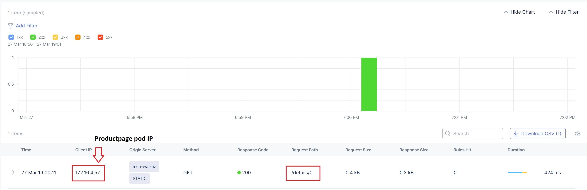
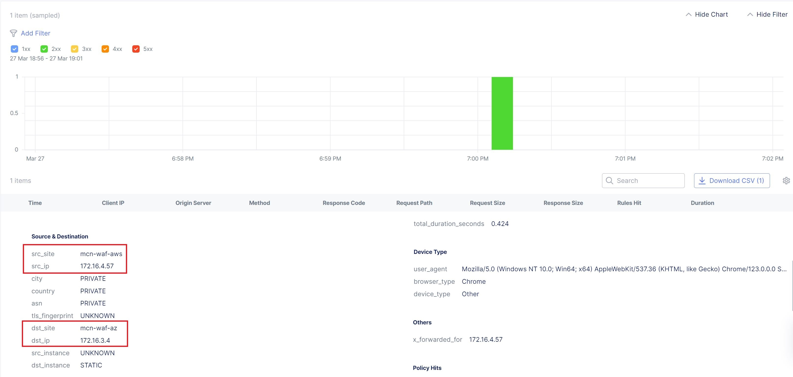
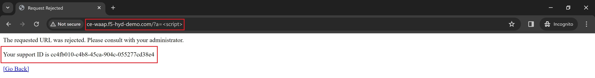
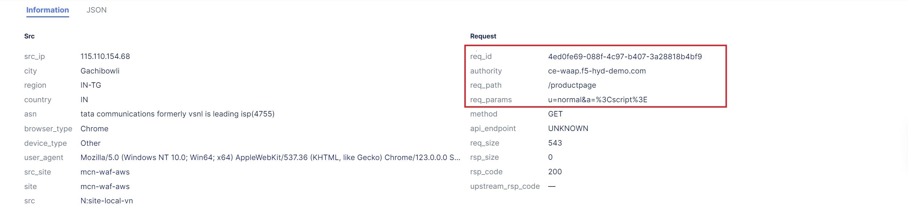

Manual step by step process for the deployment
===============================================

Traffic Flow
*************
- ProductPage and details Load Balancers (LBs) are advertised to AWS CE Site on outside and inside network respectively.
- Added a DNS entry locally in host file of client's machine to resolve frontend domain name to AWS CE site's public IP.

1. User/Client will initiate a request to product page (frontend) LB domain.
2. DNS resolution will happen and the request will enter to the AWS CE site using ingress interface and then will be redirected to productpage LB.
3. The LB has an origin pool attached to route client request to productpage microservice via AWS CE site.
4. The request will be sent to the AWS CE site.
5. The AWS CE site will then send the request to the origin server hosting productpage microservice.
6. As the origin server is the worker node of the EKS cluster, Productpage pod will then internally call the details(backend) microservice and the request will be sent to the egress interface gateway of the AWS CE site.
7. Since details LB is advertised to inside network of the AWS CE site, request can be redirected to details LB.
8. Details LB again has an origin pool configured to route traffic to the details microservice hosted in Azure cloud platform.
9. Now, the request will be sent to Azure Vnet site via F5 Distributed cloud global (private backbone) network.
10. Request will reach to the Azure Vnet site.
11. Eventually, the request will be sent to the origin server hosting details microservice, completing the entire traffic flow.

Prerequisites
**************
- Access to AWS & Azure portals.
- Access to F5 XC account.
- `AWS <https://community.f5.com/kb/technicalarticles/creating-a-credential-in-f5-distributed-cloud-to-use-with-aws/298111>`_ & `Azure <https://community.f5.com/t5/technical-articles/creating-a-credential-in-f5-distributed-cloud-for-azure/ta-p/298316>`_  credentials.
- Install AWS CLI, Azure CLI and Kubectl command line tool to connect and push the app manifest files to EKS and AKS clusters.
- Install postman for testing the setup.

Deployment Steps
*****************
1. Create Networking components in AWS like VPC and subnets. 
    i. Login to AWS portal and search VPC service, select it.
    ii. Click create VPC.
    iii. Enter VPC name, IPv4 VPC CIDR block and click create.
    iv. Navigate to Subnets, Click create subnet.
    v. Select above created VPC, enter a subnet name, IPv4 Subnet CIDR block, click create.  
          - Here we are creating 4 subnets, 2 for site local outside/inside interfaces of AWS VPC Site and 2 for workloads (As EKS cluster requires 2 subnets in different Availability Zones (AZs) to be present inside the VPC).

2. Create an AWS VPC site.
    i. Login to F5 XC Console.
    ii. Select Manage > Site Management > AWS VPC Sites in the configuration menu. Click on Add AWS VPC Site. 
    iii. Enter a name for your VPC site.
    iv. Configure “Site Type Selection” section:
          a. Select AWS cloud credential XC object, if not created click on ‘add item’ button from dropdown menu and create one referring to this `DevCentral article <https://community.f5.com/kb/technicalarticles/creating-a-credential-in-f5-distributed-cloud-to-use-with-aws/298111>`_
          b. Select a region from the AWS Region drop-down field.
          c. Select Existing VPC ID option for VPC field and copy/paste the VPC ID of VPC created in step 1.
          d. Select Ingress/Egress Gateway (Two Interface) option for the Select Ingress Gateway or Ingress/Egress Gateway field. 
          e. Click configure, add AZ and subnet IDs for workload, inside and outside subnets. Apply the configuration. 
          f. Add a public ssh key in Site Node Parameters section.
          g. Toggle Show Advanced Fields button for Advanced Configuration section then select “Allow access to DNS, SSH services on Site” for Services to be blocked on site field, Save and Exit. Click Apply. Note: It will take 15-20 mins for the site to come online. You can monitor your site health score by navigating to Home > Multi-Cloud Network Connect > Overview > Sites.
          h. For more detailed information regarding AWS Site refer to the `document <https://docs.cloud.f5.com/docs/how-to/site-management/create-aws-site>`_ 

3. Create a 1-node EKS cluster and deploy `product page </shared/booksinfo/mcn-bookinfo/product_page.yaml>`_ microservice to it. 
    i. In AWS console, search for EKS service and select it. 
    ii. Click on create cluster button.
    iii. Enter a name, select a k8s version, select a role (To create a new role follow the `instructions <https://docs.aws.amazon.com/eks/latest/userguide/service_IAM_role.html#create-service-role>`_ ), keep rest option as default and click next button 
    iv. Select VPC created in Step1.
    v. Choose 2 subnets created in Step1 for workload.
    vi. Select an existing security group or create a new one for your VPC and select it. (Make sure to add an inbound rule enabling TCP port range 30000-32767)
    vii. Select “Public and private” option for Cluster endpoint access.
    viii. Keeping rest values as default, press next buttons. Finally, review the configs and click on create button. 
    ix. Once EKS cluster is up, select it and navigate to Compute section and click Add node group.
    x. Enter a name, select a role (if not created, create it and assign. Follow `document <https://docs.aws.amazon.com/eks/latest/userguide/create-node-role.html>`_ for more info) 
    xi. Set compute and scaling configurations, here we are creating a 1 node EKS cluster.
    xii. Select the workload subnet[refer step 2(e)] for your worker node.
    xiii. Keep rest options default, review the config done and create the node group.
    xiv. Edit the `product page </shared/booksinfo/mcn-bookinfo/product_page.yaml>`_ manifest file, "enter the egress private IP of the AWS CE site in hostAliases field" and deploy the product page microservice using the kubectl command. ``kubectl apply -f product_page.yaml``

**Note:** Here, we are using product page service type as NodePort.

4. Create a HTTP Load Balancer (LB) pointing to the EKS cluster worker node as an origin server, enable WAF in blocking mode and advertise this LB to the AWS CE site itself. 
    i. Select Manage > Load Balancers > HTTP Load Balancers and click Add HTTP Load Balancer.
    ii. Enter a name for the new load balancer. Optionally, select a label and enter a description.
    iii. In the Domains field, enter a domain name.
    iv. From the "Load Balancer Type" drop-down menu, select HTTP, do not select "Automatically Manage DNS Records" option and let the HTTP Listen Port as 80.
    v. Configure origin pools: 
        a. In the Origins section, click Add Item to create an origin pool. 
        b. In the origin pool field dropdown, click Add Item.
        c. Enter name, in origin server section click Add Item.
        d. Select type of origin server as “IP address of Origin Server on given Sites”.
        e. Copy/Paste the private IP of your worker node. (You can use kubectl command ``kubectl get node –o wide`` to get the private IP).
        f. Select the AWS site created in step2, apply the configuration.
        g. Copy/Paste product page service port to the origin server port field (Range [30000-32767], use kubectl command ``kubectl get svc`` to get the port value), apply the configuration.
        h. Enable WAF and select the WAF policy. If not created, create a WAF policy in blocking mode and attach it to the LB.
        i. Scroll down to “Other Settings” section.
            -  Here, in “VIP Advertisement” select custom and add the configs as shown in below image
        j. Save the configurations. 

**- Below steps are related to Azure configurations**.

5. Create credential for Azure by following the steps mentioned in the `devcentral article <https://community.f5.com/t5/technical-articles/creating-a-credential-in-f5-distributed-cloud-for-azure/ta-p/298316>`_ 

6. Create Resource group, Vnet, Subnets in Azure.
      i. Login to Azure console and search for "Resource groups".
      ii. Click on Create button, select your subscription, add the resource group name and region.
      iii. Click “Review + create” and "Create".
      iv. Search for "Virtual networks" and click Create button.
      v. Select your subscription, set the above created resource group name, virtual network name and region.
      vi. Navigate to IP addresses tab, Configure your virtual network address space and subnets (slo, sli and workload).
      vii. Click “Review + create” and "Create".

7. Create Azure Vnet site **[Select Ingress/Egress Gateway (Two Interface) option]**
      i. From the Console homepage, select "Multi-Cloud Network Connect".
      ii. Select "Manage > Site Management", select "Azure VNET Sites" and click on "Add Azure VNET Site".
      iii. Enter a name, optionally select a label and add a description.
      iv. In the Site Type Selection section: 
            a. Enter a new Azure resource group name in the “Resource Group” field, make sure to avoid naming existing resource group names.
            b. Select a region from the Recommended or Alternate Azure Region Names.
            c. Configure Vnet field by selecting "Existing Vnet" and filling in Existing Vnet Resource Group and Existing Vnet Name.
            d. Configure the ingress/egress gateways by entering created subnet details.
            e. Select the Azure cloud credentials created in Step 5.
      v. Add a public ssh key in Site Node Parameters section.
      vi. Toggle Show Advanced Fields button for Advanced Configuration section then select “Allow access to DNS, SSH services on Site” for Services to be blocked on site field, Save and Exit. Click Apply. **Note:** It will take 15-20 mins for the site to come online. You can monitor your site health score by navigating to Home > Multi-Cloud Network Connect > Overview > Sites.
      vii. For more detailed explanation about Azure site creation, refer to the `document <https://docs.cloud.f5.com/docs/how-to/site-management/create-azure-site>`_

8. Create a 1-node AKS cluster and deploy `details </shared/booksinfo/mcn-bookinfo/details.yaml>`_ microservice to it.
      i. From Azure cloud console search for “Kubernetes services”.
      ii. Click on Create button and select "Create Kubernetes cluster".
      iii. Select your subscription and above created resource group.
      iv. Set Cluster preset configuration as "Dev/Test", enter cluster name and fill in the remaining cluster details as per the requirement, make sure to use same "Region" as that of the created resource groups, click on next button.
      v. Configure node pool, select scale method as manual and enter 1 as a node count.
      vi. Navigate to “Networking” tab and click on "Bring your own virtual network", Select the Virtual network created in Step 6 and set workload subnet as Cluster subnet.
      vii. Optionally, disable monitoring section and Click “Review + create” and then create button to bring up the AKS cluster.
      viii. Select the created AKS cluster and click connect button. Follow the instructions to connect to the AKS cluster.
      ix. Once connected, deploy `details </shared/booksinfo/mcn-bookinfo/details.yaml>`_ manifest file to the AKS cluster, for that execute ``kubectl apply -f details.yaml`` command.

9. Create a HTTP Load Balancer (LB) pointing to the AKS cluster worker node as an origin server, enable WAF in blocking mode and advertise this LB as well to the AWS CE site with site network field set to inside.
    i. Select Manage > Load Balancers > HTTP Load Balancers and click Add HTTP Load Balancer.
    ii. Enter a name for the new load balancer. Optionally, select a label and enter a description.
    iii. In the Domains field, enter domain name as details.
    iv. From the 'Load Balancer Type' drop-down menu, select HTTP, do not select "Automatically Manage DNS Records" option and set HTTP Listen Port to 9080.
    v. Configure origin pools: 
        a. In the Origins section, click Add Item to create an origin pool. 
        b. In the origin pool field dropdown, click Add Item.
        c. Enter name, in origin server section click Add Item.
        d. Select type of origin server as “IP address of Origin Server on given Sites”.
        e. Copy/Paste the private IP of your worker node. (You can use kubectl command ``kubectl get node –o wide`` to get the private IP).
        f. Select the Azure site created in step7, apply the configuration.
        g. Copy/Paste details service port to the origin server port field (Range [30000-32767], use kubectl command ``kubectl get svc`` to get the port value), apply the configuration.
        h. Enable WAF and select the WAF policy. If not created, create a WAF policy in blocking mode and attach it to the LB.
        i. Scroll down to “Other Settings” section.
            -  Here, in “VIP Advertisement” select custom and add the configs as shown in below image.
        j. Save the configurations. 

**Note: Since the details LB is advertised to AWS CE site on inside network, details page cannot be accessible directly from outside(internet). Additionally, attached WAF policies on both frontend and backend loadbalancers will help provide robust security to the application environment**

Testing: 
*********

1. For testing purpose edit your local machine's hosts file by adding a line for IP(AWS CE site public IP) to domain(productpage LB domain) mapping or if you have a registered domain name, set up DNS record.

2. Open a browser, enter product page (frontend) domain name in the URL bar and send the request.

3. Once request is successful monitor the request logs in the XC console.

 
4. Click on "Normal user" hyperlink, it will internally initiate a request from frontend to backend. This step covers end to end testing.

5. Now, monitor the request logs of product page and details LB from the XC Console. 

6. Let's try a dummy cross-site-scripting attack.

9. Now, monitor the security event logs from the XC console.

Step by step process using automation scripts
#############################################

Coming Soon...

**Support**
############

For support, please open a GitHub issue. Note, the code in this repository is community supported and is not supported by F5 Networks. 
