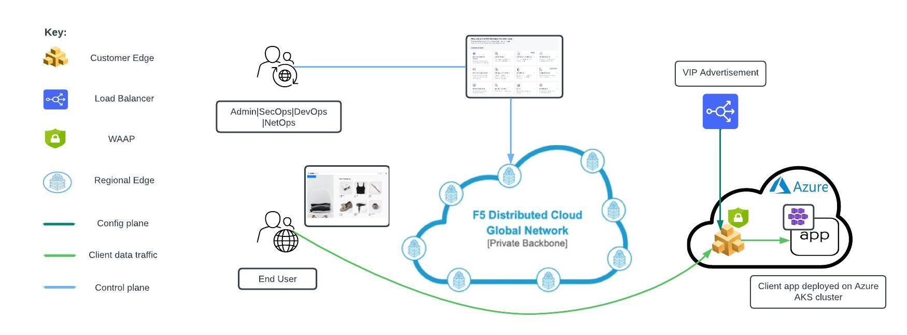
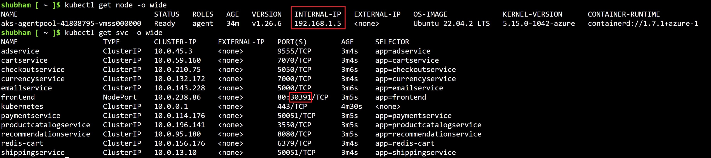
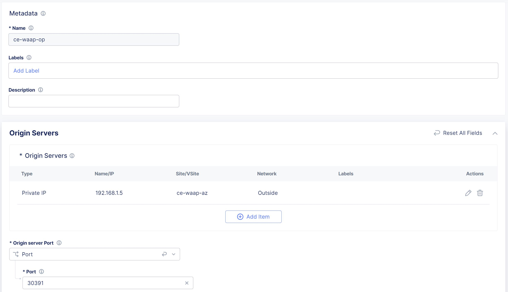
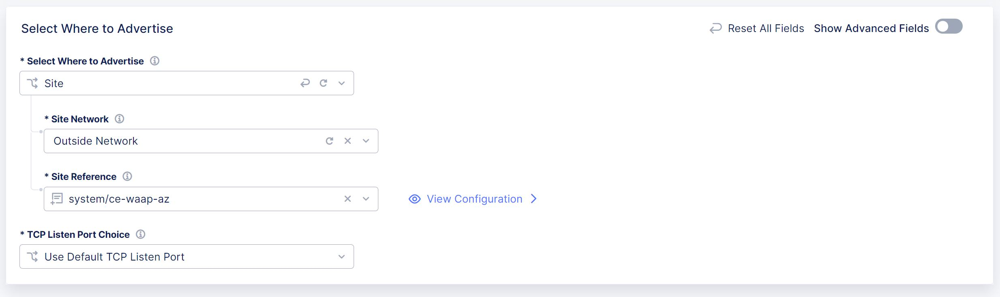
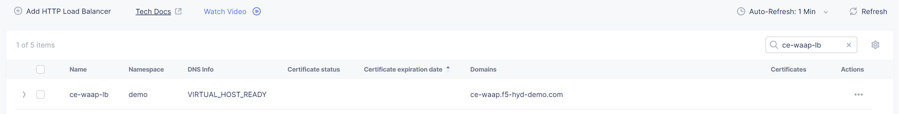
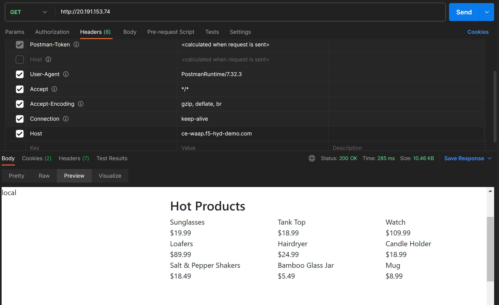
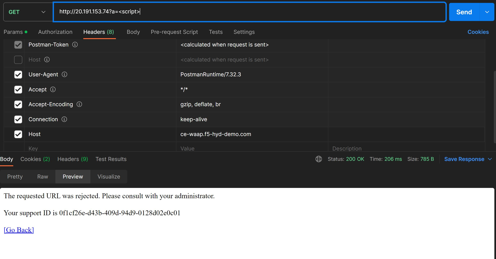
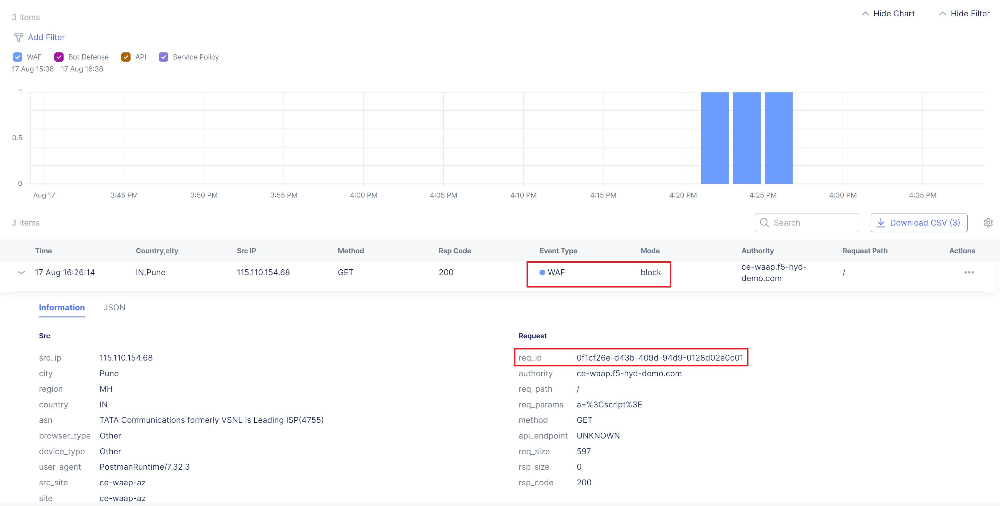

Deploying F5 XC WAF on Customer Edge (Single cloud scenario)
=============================

--------------

.. contents:: **Table of Contents**

Overview
#########

This demo guide provides step-by-step walkthrough for deploying WAF on CE site manually using XC console along with terraform scripts to automate the deployment. For more information on different WAAP deployment modes, refer to the devcentral article: `Deploy WAAP Anywhere with F5
Distributed Cloud <https://community.f5.com/t5/technical-articles/deploy-waap-anywhere-with-f5-distributed-cloud/ta-p/313079>`__.

**Note:** Even though the scenario here focuses on XC WAF, customers can enable any security services in the same setup, such as API Security, Bot Defense, DoS/DDOS and Fraud, as per their needs.

Setup Diagram
#############

Manual step by step process for the deployment
##############################################

Prerequisites
**************
- Access to Azure portal 
- Access to F5 XC account 
- Install Azure Cli and kubectl command line tool to connect and push the app manifest file to AKS cluster 
- Install postman for testing the setup 

Deployment Steps
*****************

1. Create credential for Azure by following the steps mentioned in the `devcentral article <https://community.f5.com/t5/technical-articles/creating-a-credential-in-f5-distributed-cloud-for-azure/ta-p/298316>`_ 
2. Create Azure Vnet site from F5 XC console: 
      i. From the Console homepage, select "Multi-Cloud Network Connect".
      ii. Select "Manage > Site Management", select "Azure VNET Sites" and click on "Add Azure VNET Site".
      iii. Enter a name, optionally select a label and add a description.
      iv. In the Site Type Selection section: 
            a. Enter your Azure resource group name in the “Resource Group” field, make sure to avoid naming existing resource group names.
            b. Select a region from the Recommended or Alternate Azure Region Names.
            c. Configure Vnet field by selecting either existing Vnet or configuring new Vnet parameters.
            d. Configure the ingress or ingress/egress gateways.
            e. Select the Azure cloud credentials created in Step 1 
      v. Add a public ssh key in Site Node Parameters section 
      vi. Toggle Show Advanced Fields button for Advanced Configuration section then select “Allow access to DNS, SSH services on Site” for Services to be blocked on site field, Save and Exit. Click Apply. **Note:** It will take 15-20 mins for the site to come online. You can monitor your site health score by navigating to Home > Multi-Cloud Network Connect > Overview > Sites 
      vii. For a more detailed explanation about Azure site creation, refer to the `document <https://docs.cloud.f5.com/docs/how-to/site-management/create-azure-site>`_

.. figure:: assets/img1.JPG

3. Create Azure AKS cluster. 
      i. Login to Azure console and search for “Kubernetes services”
      ii. Click on Create button and select Create Kubernetes cluster
      iii. Select your subscription and add the same resource group as that of your Azure Vnet CE site 
      iv. Fill in the remaining cluster details and primary node pool fields as needed 
      v. Navigate to “Networking” tab and select “Network configuration” as Azure CNI 
      vi. Select the same Virtual network as that of your Azure Vnet site
      vii. Click “Review + create” and create the cluster

4. Select the created AKS cluster and click connect. Follow the instructions to connect to the AKS cluster 
5. Deploy Online boutique demo application using the `manifest file <https://github.com/GoogleCloudPlatform/microservices-demo/blob/main/release/kubernetes-manifests.yaml>`_
            i. Execute ``kubectl apply -f <your_manifest.yaml>`` (Note: we have slightly modified the manifest file)
            ii. Check the status of the pods, execute ``kubectl get pods``

.. figure:: assets/img2.JPG

* Note down the private IP of the node and internal port of the frontend service

6. Now, create a HTTP LB in F5 XC console and add the application server as an origin pool member 
            i. Select Multi-Cloud App Connect service 
            ii. Select Manage > Load Balancers > HTTP Load Balancers and click Add HTTP Load Balancer 
            iii. Enter a name for the new load balancer. Optionally, select a label and enter a description. 
            iv. In the Domains field, enter a domain name 
            v. From the Load Balancer Type drop-down menu, select HTTP 
            vi. Configure origin pools:
                        a. In the Origins section, click Add Item to create an origin pool.
                        b. In the origin pool field dropdown, click Add Item 
                        c. Enter name, in origin server section click Add Item 
                        d. Select “IP address of Origin Server on given Sites”: 
                                    * Use the private IP of the node saved above in Step 5 
                                    * Select the Azure Vnet site created in Step 2, Apply 
                        e. In Origin server port add the port of the frontend service saved in Step 5, Click continue and then Apply

* Enable WAF, and create and attach a WAF policy in Blocking mode 
* Scroll down to “Other settings” section: 
                        a. In VIP Advertisement field select custom 
                        b. Click Configure and then Add Item 
                        c. Select Where to Advertise field to site and add the Azure site created in step2 
                        d. Select Site network to outside, Click Apply, Save and Exit 

Testing
********

1. Open postman 
2. Enter the public IP of the Azure CE site in the URL field 
3. Uncheck the default host header value and create a custom host header with its value as the domain of F5 XC LB 
4. Generate a GET request and monitor the request logs from F5 XC UI dashboard 

.. figure:: assets/img9.JPG

5. Generate a XSS attack by adding <script> tag as a query parameter in the above GET request and monitor the security event logs from F5 XC UI dashboard 

Step by step process using automation scripts (Coming soon)
#############################################

Coming soon...

**Support**

For support, please open a GitHub issue. Note, the code in this repository is community supported and is not supported by F5 Networks. 

 
