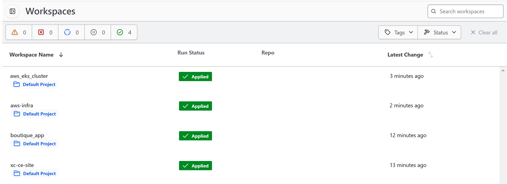
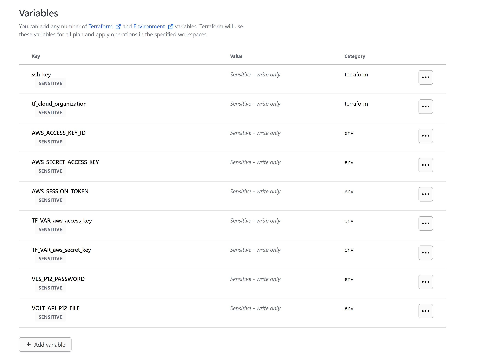
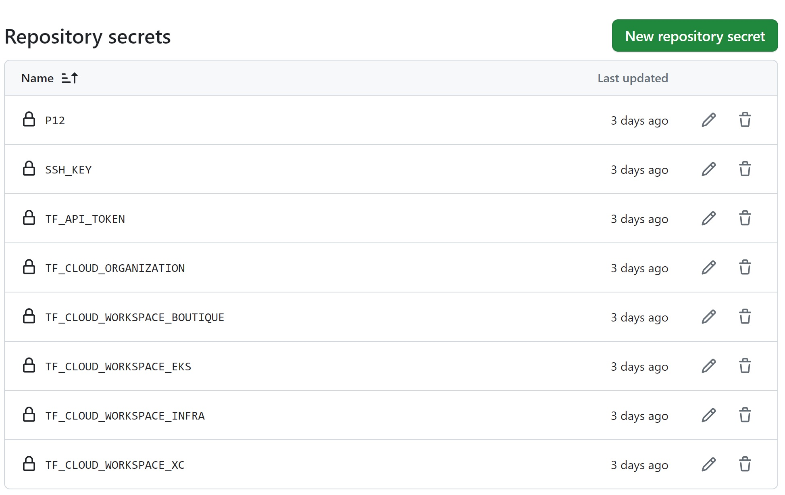
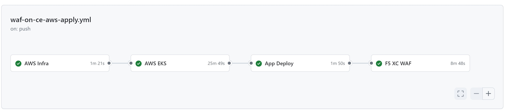
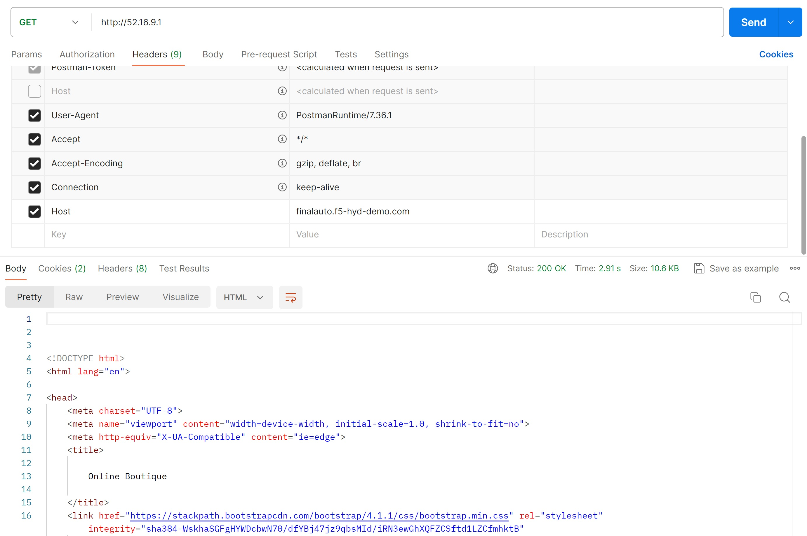
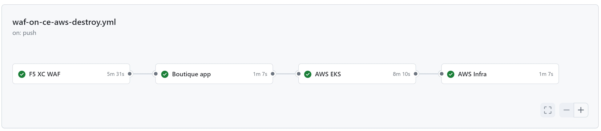

Getting started with WAF on CE terraform automation
#####################################################

Prerequisites
--------------

-  `F5 Distributed Cloud (F5 XC) Account <https://console.ves.volterra.io/signup/usage_plan>`__
-  `AWS Account <https://aws.amazon.com/>`__ 
-  `Terraform Cloud Account <https://developer.hashicorp.com/terraform/tutorials/cloud-get-started>`__
-  `GitHub Account <https://github.com>`__

List of Existing Assets
------------------------

-  **xc:** F5 Distributed Cloud WAF
-  **infra:** AWS Infrastructure
-  **EKS:** Amazon Elastic Kubernetes Service
-  **online boutique:** Online Boutique demo test web application

Tools
------

-  **Cloud Provider:** AWS
-  **IAC:** Terraform
-  **IAC State:** Terraform Cloud
-  **CI/CD:** GitHub Actions

Terraform Cloud
----------------

-  **Workspaces:** Create CLI or API workspaces for each asset in the workflow as mentioned below.

   +---------------------------+-----------------------------------------------------+
   |         **Workflow**      |  **Assets/Workspaces**                              |
   +===========================+=====================================================+
   | F5 XC WAF on CE Deploy    | aws-infra, aws_eks_cluster, boutique_app, xc-ce-site|
   +---------------------------+-----------------------------------------------------+

-  **Workspace Sharing:** Under the settings for each Workspace, set the
   **Remote state sharing** to share with each Workspace created.

-  **Variable Set:** Create a Variable Set with the following values:

   +------------------------------------------+--------------+------------------------------------------------------+
   |         **Name**                         |  **Type**    |      **Description**                                 |
   +==========================================+==============+======================================================+
   | AWS_ACCESS_KEY_ID                        | Environment  |AWS Access Key ID                                     |
   +------------------------------------------+--------------+------------------------------------------------------+
   | AWS_SECRET_ACCESS_KEY                    | Environment  |AWS Secret Access Key ID                              |
   +------------------------------------------+--------------+------------------------------------------------------+
   | AWS_SESSION_TOKEN                        | Environment  |AWS Session Token                                     | 
   +------------------------------------------+--------------+------------------------------------------------------+
   | TF_VAR_aws_access_key                    | Environment  |AWS Programmatic Access Key ID                        |
   +------------------------------------------+--------------+------------------------------------------------------+
   | TF_VAR_aws_secret_key                    | Environment  |AWS Programmatic Secret Access Key                    |
   +------------------------------------------+--------------+------------------------------------------------------+
   | VES_P12_PASSWORD                         | Environment  |Password set while creating F5XC API certificate      |
   +------------------------------------------+--------------+------------------------------------------------------+
   | VOLT_API_P12_FILE                        | Environment  |Your F5XC API certificate. Set this to **api.p12**    |
   +------------------------------------------+--------------+------------------------------------------------------+
   | ssh_key                                  | TERRAFORM    |Your ssh key for accessing the created resources      | 
   +------------------------------------------+--------------+------------------------------------------------------+
   | tf_cloud_organization                    | TERRAFORM    |Your Terraform Cloud Organization name                |
   +------------------------------------------+--------------+------------------------------------------------------+

-  Variable set created in terraform cloud: 

GitHub
-------

-  Fork and Clone Repo. Navigate to ``Actions`` tab and enable it.

-  **Actions Secrets:** Create the following GitHub Actions secrets in
   your forked repo

   -  P12: The linux base64 encoded F5XC P12 certificate
   -  SSH_KEY: ssh key for accessing the created resources
   -  TF_API_TOKEN: Your Terraform Cloud API token
   -  TF_CLOUD_ORGANIZATION: Your Terraform Cloud Organization name
   -  TF_CLOUD_WORKSPACE_BOUTIQUE: boutique_app
   -  TF_CLOUD_WORKSPACE_EKS: aws_eks_cluster
   -  TF_CLOUD_WORKSPACE_INFRA: aws-infra
   -  TF_CLOUD_WORKSPACE_XC: xc-ce-site
   

-  Created GitHub Action Secrets: 

Workflow Runs
--------------

**STEP 1:** Check out a branch with the branch name as suggested below for the workflow you wish to run using
the following naming convention.

**DEPLOY**

======================        =======================
Workflow                      Branch Name
======================        =======================
F5 XC WAF on CE Deploy        deploy-waf-aws-ce
======================        =======================

Workflow File: `waf-on-ce-aws-apply.yml </.github/workflows/waf-on-ce-aws-apply.yml>`__

**DESTROY**

========================        =======================
Workflow                        Branch Name
========================        =======================
F5 XC WAF on CE Destroy         destroy-waf-aws-ce
========================        =======================

Workflow File: `waf-on-ce-aws-destroy.yml </.github/workflows/waf-on-ce-aws-destroy.yml>`__

**STEP 2:** Rename ``aws/infra/terraform.tfvars.examples`` to ``aws/infra/terraform.tfvars`` and add the following data: 

-  project_prefix = “Your project identifier name in **lower case** letters only - this will be applied as a prefix to all assets”

-  aws_region = “AWS Region” ex. "eu-west-1"

-  azs = Availability Zones of that region. Ex. ["eu-west-1a", "eu-west-1b"]

-  Also update assets boolean value as per your workflow.

**STEP 3:** Rename ``aws/eks-cluster/terraform.tfvars.examples`` to ``aws/eks-cluster/terraform.tfvars`` and add the following data: 

-  skip_ha_az_node_group = "Set boolean to true for the deployment of WAF on AWS CE Use case"
-  desired_size = "set to number 1"
-  max_size = "set to number 1"
-  min_size = "set to number 1"
-  skip_private_subnet_creation = "set the boolean to true to deploy EKS Cluster Nodes in Public Subnets"
-  allow_all_ingress_traffic_to_cluster = "Set the boolean to true to accept the traffic from F5 XC VPC Site(master)"
-  aws_waf_ce = "aws-infra"

**Step 4:** Rename ``xc/terraform.tfvars.examples`` to ``xc/terraform.tfvars`` and add the following data: 

-  api_url = “Your F5XC tenant” 

-  xc_tenant = “Your tenant id available in F5 XC ``Administration`` section ``Tenant Overview`` menu” 

-  xc_namespace = “The existing XC namespace where you want to deploy resources” 

-  app_domain = “the FQDN of your app (cert will be autogenerated)” 

-  xc_waf_blocking = “Set to true to configure waf in blocking mode”

-  aws_ce_site = "set to true to deploy AWS CE site"

-  site_name = "Provide a name for AWS VPC site"

-  ip_address_on_site_pool = "Set to true to configured the Private IP address of the EKS Cluster Nodes"

-  advertise_sites = "set to true to advertise on public"

-  http_only = "set to true to deploy a http loadbalancer."

-  aws = "aws-infra"

Keep the rest of the values as they are.

**STEP 4:** Commit and push your build branch to your forked repo 

- Build will run and can be monitored in the GitHub Actions tab and TF Cloud console

**STEP 5:** Once the pipeline completes, verify your CE, Origin Pool and LB were deployed or destroyed based on your workflow. (**Note:** CE sites will take 15-20 mins to come online)

**STEP 6:** To validate the test infra, copy the public IP of CE site (**Note:** In terraform cloud click on `xc-deploy` workspace and select `Outputs` tab to get the public of azure CE site) and send a request with XC LB domain as a `Host` header, You should be able to access the demo application as shown in the image below:

**Note:** If you want to destroy the entire setup, checkout a branch with name ``destroy-waf-aws-ce`` and push the repo code to it which will trigger destroy workflow and will remove all created resources.

**Note:** Due to timing issue there might be chance of not deleting the AWS VPC site. Please remove the VPS site while deploying Infra again.

