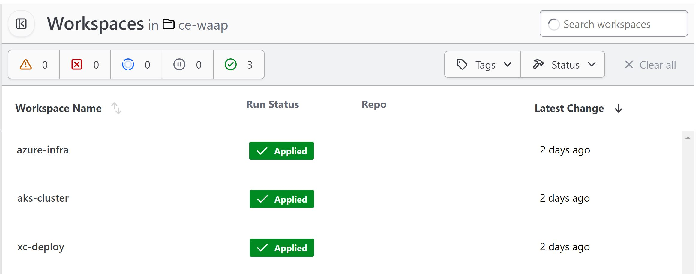

Getting started with WAF on CE terraform automation
######################################################

Prerequisites
--------------

-  `F5 Distributed Cloud (F5 XC) Account <https://console.ves.volterra.io/signup/usage_plan>`__
-  `Azure Account <https://azure.microsoft.com/en-in/get-started/azure-portal/>`__ 
-  `Terraform Cloud Account <https://developer.hashicorp.com/terraform/tutorials/cloud-get-started>`__
-  `GitHub Account <https://github.com>`__

List of Existing Assets
------------------------

-  **xc:** F5 Distributed Cloud WAF
-  **infra:** Azure Infrastructure
-  **aks:** Azure Kubernetes Service
-  **online boutique:** Online Boutique demo test web application

Tools
------

-  **Cloud Provider:** Azure
-  **IAC:** Terraform
-  **IAC State:** Terraform Cloud
-  **CI/CD:** GitHub Actions

Terraform Cloud
----------------

-  **Workspaces:** Create CLI or API workspaces for each asset in the
   workflow.

   +---------------------------+-------------------------------------------+
   |         **Workflow**      |  **Assets/Workspaces**                    |
   +===========================+===========================================+
   | f5-xc-waf-on-ce           | azure-infra, aks-cluster, xc-deploy       |
   +---------------------------+-------------------------------------------+

-  **Workspace Sharing:** Under the settings for each Workspace, set the
   **Remote state sharing** to share with each Workspace created.

-  **Variable Set:** Create a Variable Set with the following values:

   +------------------------------------------+--------------+------------------------------------------------------+
   |         **Name**                         |  **Type**    |      **Description**                                 |
   +==========================================+==============+======================================================+
   | TF_VAR_azure_service_principal_appid     | Environment  |Service Principal App ID                              |
   +------------------------------------------+--------------+------------------------------------------------------+
   | TF_VAR_azure_service_principal_password  | Environment  |Service Principal Secret                              |
   +------------------------------------------+--------------+------------------------------------------------------+
   | TF_VAR_azure_subscription_id             | Environment  |Your Subscription ID                                  | 
   +------------------------------------------+--------------+------------------------------------------------------+
   | TF_VAR_azure_subscription_tenant_id      | Environment  |Subscription Tenant ID                                |
   +------------------------------------------+--------------+------------------------------------------------------+
   | VES_P12_PASSWORD                         | Environment  |Password set while creating F5XC API certificate      |
   +------------------------------------------+--------------+------------------------------------------------------+
   | VOLT_API_P12_FILE                        | Environment  |Your F5XC API certificate. Set this to **api.p12**    |
   +------------------------------------------+--------------+------------------------------------------------------+
   | ssh_key                                  | TERRAFORM    |Your ssh key for accessing the created resources      | 
   +------------------------------------------+--------------+------------------------------------------------------+
   | tf_cloud_organization                    | TERRAFORM    |Your Terraform Cloud Organization name                |
   +------------------------------------------+--------------+------------------------------------------------------+

-  Variable set created in terraform cloud:

.. image:: assets/variable-set.JPG

GitHub
-------

-  Fork and Clone Repo. Navigate to ``Actions`` tab and enable it.

-  **Actions Secrets:** Create the following GitHub Actions secrets in
   your forked repo

   -  P12: The linux base64 encoded F5XC P12 certificate
   -  TF_API_TOKEN: Your Terraform Cloud API token
   -  TF_CLOUD_ORGANIZATION: Your Terraform Cloud Organization name
   -  TF_CLOUD_WORKSPACE\_\ *<Workspace Name>*: Create for each
      workspace in your workflow per each job

      -  EX: TF_CLOUD_WORKSPACE_AZURE_INFRA would be created with the
         value ``azure-infra``

      -  EX: TF_CLOUD_WORKSPACE_AKS_CLUSTER would be created with the
         value ``aks-cluster``

      -  EX: TF_CLOUD_WORKSPACE_XC_DEPLOY would be created with the
         value ``xc-deploy``

-  Created GitHub Action Secrets:

.. image:: assets/action-secret.JPG

Workflow Runs
--------------

**STEP 1:** Check out a branch with the branch name as suggested below for the workflow you wish to run using
the following naming convention.

**DEPLOY**

================ =======================
Workflow         Branch Name
================ =======================
f5-xc-waf-on-ce  deploy-waf-az-ce
================ =======================

Workflow File: `waf-on-ce-az-apply.yml </.github/workflows/waf-on-ce-az-apply.yml>`__

**DESTROY**

================ ========================
Workflow         Branch Name
================ ========================
f5-xc-waf-on-ce  destroy-waf-az-ce
================ ========================

Workflow File: `waf-on-ce-az-destroy.yml </.github/workflows/waf-on-ce-az-destroy.yml>`__

**STEP 2:** Rename ``azure/azure-infra/terraform.tfvars.examples`` to ``azure/azure-infra/terraform.tfvars`` and add the following data: 

-  Set project_prefix = “Your project identifier name in **lower case** letters only - this will be applied as a prefix to all assets”

-  Set azure_region = “Azure Region/Location” ex. "southeastasia"

-  Set aks-cluster to true

-  Also update assets boolean value as per your workflow (for this use-case set all remaining values as false)

**Step 3:** Rename ``xc/terraform.tfvars.examples`` to ``xc/terraform.tfvars`` and add the following data: 

-  api_url = “Your F5XC tenant” 

-  xc_tenant = “Your tenant id available in F5 XC ``Administration`` section ``Tenant Overview`` menu” 

-  xc_namespace = “The existing XC namespace where you want to deploy resources” 

-  app_domain = “the FQDN of your app (cert will be autogenerated)” 

-  xc_waf_blocking = “Set to true to configure waf in blocking mode”

-  k8s_pool = "set to true if application is residing in k8s environment"

-  serviceName = "k8s service name of frontend microservice" (for this use case set it to "frontend.default")

-  serviceport = "k8s service port of frontend microservice" (for this use case set it to "80")

-  advertise_sites = "set to false if want to advertise on public"

-  http_only = "set to true if want to deploy a http loadbalancer, for https lb set it to false"

-  az_ce_site = "set to true if want to deploy azure CE site"

-  xc_service_discovery = "set to true if want to create service discovery object in XC console"

-  Set azure = "azure-infra"

Keep rest of the values as they are set by default in terraform.tfvars.examples file.

**STEP 4:** Commit and push your build branch to your forked repo 

- Build will run and can be monitored in the GitHub Actions tab and TF Cloud console

.. image:: assets/deploy_pipeline.JPG

**STEP 5:** Once the pipeline completes, verify your CE, Origin Pool and LB were deployed or destroyed based on your workflow. (**Note:** CE sites will take 15-20 mins to come online)

**STEP 6:** To validate the test infra, copy the public IP of CE site (**Note:** In terraform cloud click on `xc-deploy` workspace and select `Outputs` tab to get the public of azure CE site) and send a request with XC LB domain as a `Host` header, You should be able to access the demo application as shown in the image below:

.. image:: assets/testing.JPG

**Note:** If you want to destroy the entire setup, checkout a branch with name ``destroy-waf-ce`` and push the repo code to it which will trigger destroy workflow and will remove all created resources

.. image:: assets/destroy_pipeline.JPG

