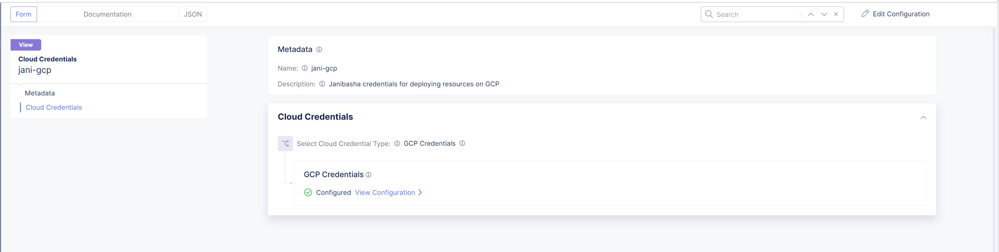
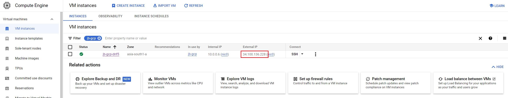
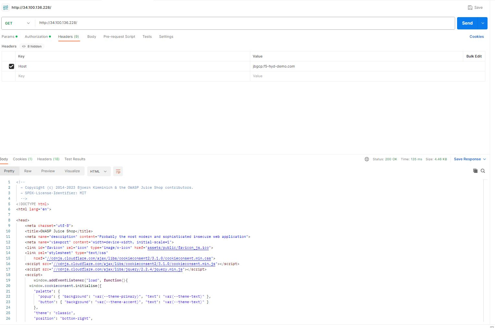
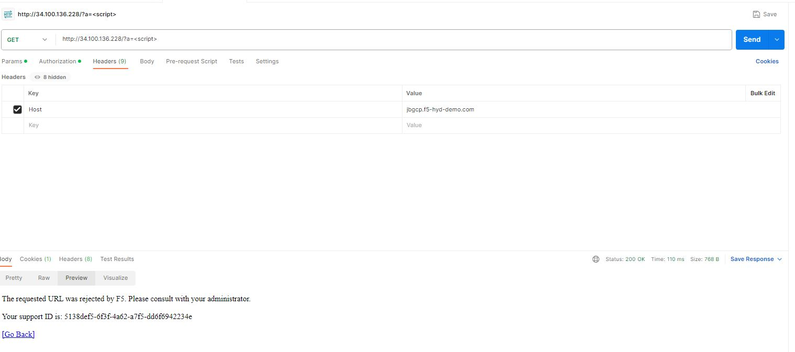
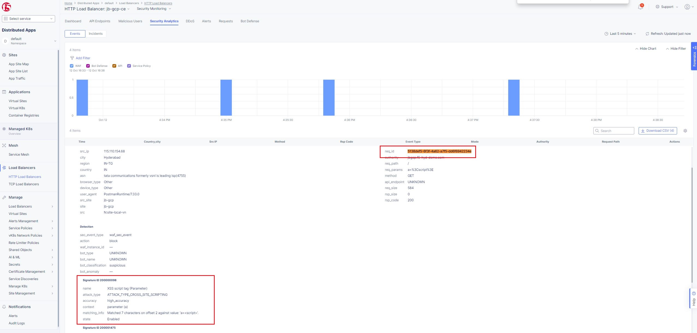

Deploying F5 XC WAF on Customer Edge hosted in Google Cloud
=============================

--------------

.. contents:: **Table of Contents**

Overview
#########

This demo guide provides step-by-step walkthrough for deploying WAF on CE site in Google Cloud manually using XC console along with terraform scripts to automate the deployment. For more information on different WAF deployment modes, refer `Deploy WAF Anywhere with F5 Distributed Cloud <https://community.f5.com/t5/technical-articles/deploy-waap-anywhere-with-f5-distributed-cloud/ta-p/313079>`__.

**Note:** Even though the scenario here focuses on XC WAF, customers can enable any security services in the same setup, such as API Security, Bot Defense, DoS/DDOS and Fraud, as per their needs.

Setup Diagram
#############

Manual step for deployment
##############################################

Prerequisites
**************
- Access to GCP portal and also connected to a subscription having editor permissions. Contact `GCP support <https://cloud.google.com/free>`_ for account creation
- GCP VPC, security group rules opened for port 80 and subnet related resources already created in google cloud. Check `here <https://cloud.google.com/vpc/docs/create-modify-vpc-networks>`_ for more info
- Virtual machine deployed in above VPC & site using ubuntu operating system. Check `google cloud document <https://cloud.google.com/compute/docs/instances/create-start-instance>`_ for more details
- Access to F5 Distributed Cloud (XC) account. Contact `support <https://www.f5.com/cloud>`_ for more details
- Postman installed locally for accessing the application
- SSH key pair - check `GCP doc <https://cloud.google.com/compute/docs/connect/create-ssh-keys>`_ for key pair generation
- Docker & juiceshop demo application deployed in above virtual machine and container running on port 80. Check `Juiceshop document <https://github.com/juice-shop/juice-shop>`_ for more details
**Note:** Once deployed, note down the private IP of the virtual machine

Deployment Steps
*****************

1. Create GCP credential in XC by following the steps mentioned in this `Devcentral article <https://community.f5.com/t5/technical-articles/creating-a-credential-in-f5-distributed-cloud-for-gcp/ta-p/298290>`_ 

2. Create an IAM role and attach it to google cloud service account by following `GCP policy doc <https://docs.cloud.f5.com/docs/reference/cloud-cred-ref/gcp-vpc-pol-reference>`_
3. Create GCP site from F5 XC console: 
      i. From the XC console homepage, select "Multi-Cloud Network Connect"
      ii. Navigate to Manage > Site Management section, then select "GCP VPC Sites" and click on "Add GCP VPC Site"
      iii. Enter a name, optionally select a label and add a description
      iv. Enter the google cloud region and then click on "configure" button in "ingress gateway (one interface)" section: 
            a. Enter your GCP region name in the “Zone Name” field
            b. In "Main Nodes" section, select your count of nodes to be deployed. For ex: 1
            c. From "VPC Network" drop-down, select existing VPC Network option and then provide your VPC name created in prerequisites step2
            d. From "Subnet for Local interface" drop-down, select existing subnet option and then provide subnet name created in prerequisites step2
            e. Click on "Apply" button
      v.  Next select your GCP credentials created in step 1 and then add a public ssh key created in prerequisites section 
      vi. Toggle Show Advanced Fields button for Advanced Configuration section then select “Allow access to DNS, SSH services on Site” for Services to be blocked on site field, Save and Exit. Click Apply. **Note:** It will take 15-20 mins for the site to come online. 

      .. figure:: assets/gcp-site-online.JPG

      vii. You can monitor your site health score by navigating to Home > Multi-Cloud Network Connect > Overview > Sites 

      .. figure:: assets/gcp-site-online2.JPG

      viii. For a more detailed explanation about GCP VPC site creation, refer to this `GCP site document <https://docs.cloud.f5.com/docs/how-to/site-management/create-gcp-site>`_

4. Finally, create a HTTP Load balancer in F5 XC console and add the application server as below
      i. Select Multi-Cloud App Connect service 
      ii. Select Manage > Load Balancers > HTTP Load Balancers and click Add HTTP Load Balancer 
      iii. Enter a name for the new load balancer. Optionally, select a label and enter a description
      iv. In the Domains field, enter a FQDN for accessing demo application
      v. From the Load Balancer Type drop-down menu, select HTTP Load Balancer
      vi. Configure origin pool as below
                  a. In the Origins section, click Add Item to create an origin pool
                  b. In the origin pool field dropdown, click Add Item 
                  c. Enter name, in origin server section click Add Item 
                  d. Select “IP address of Origin Server on given Sites” and select below details
                        * Use the private IP of the backend saved in prerequisites last step 
                        * Select the GCP site created in Step 3,  then click on Apply 
                  e. In Origin server port add 80, select network as outside, click continue and then Apply which will create orin pool as below

                  .. figure:: assets/origin-pool.JPG

      vii. Enable WAF from drop-down, create and attach a new WAF policy in Blocking mode

      .. figure:: assets/lb-details1.JPG

      viii. Navigate to "Other settings", then from "VIP advertisement" section, select custom and then add your site details as shown below

      .. figure:: assets/lb-advertise.JPG

      ix. Click Apply, Save and Exit the load balancer configuration which will create load balancer

Testing
********

1. Open postman, enter the public IP of the CE site deployed in google cloud as shown below

2. Add a"Host" header with value as domain name of XC load balancer created in above step 4 - substep iv
3. Send GET request and validate application is accessible 

4. Generate a XSS attack by adding <script> tag as a query parameter in the above GET request and validate request is blocked as shown below 

5. From XC console, navigate to load balancer security analytics tab and validate the reason why above XSS request is blocked as below

Setup Cleanup
*****************

Optionally once you have completed deployment and testing, you can cleanup above created resources as below
  a. From XC console, navigate to Multi Cloud App connect and then delete your load balancer, firewall & origin pool
  b. In XC console, from Multi Cloud Network Connect menu, navigate to GCP VPC site, select your site and click on Destroy button
  c. From google cloud console, if not needed you can delete virtual machine and VPC related resources created in prerequisites section

Automation process using terraform scripts
#############################################

Coming soon...

Support
#############################################

For support, please open a GitHub issue. Note, the code in this repository is community supported and is not supported by F5 Networks. 
