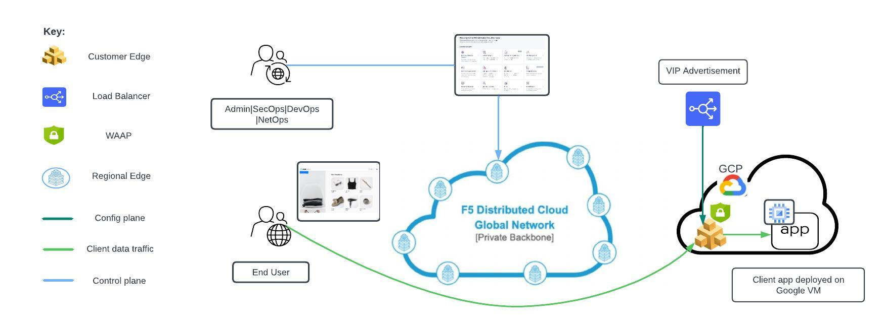

Deploying F5 XC WAF on Customer Edge hosted in Google Cloud
=============================

--------------

.. contents:: **Table of Contents**

Overview
#########

This demo guide provides step-by-step walkthrough for deploying WAF on CE site in Google Cloud manually using XC console along with terraform scripts to automate the deployment. For more information on different WAF deployment modes, refer `Deploy WAF Anywhere with F5 Distributed Cloud <https://community.f5.com/t5/technical-articles/deploy-waap-anywhere-with-f5-distributed-cloud/ta-p/313079>`__.

**Note:** Even though the scenario here focuses on XC WAF, customers can enable any security services in the same setup, such as API Security, Bot Defense, DoS/DDOS and Fraud, as per their needs.

Setup Diagram
#############

Workflow Instructions
######################

`F5 Distributed Cloud Console Workflow <./xc-console-demo-guide.rst>`__

`F5 Distributed Cloud Automation Workflow <./automation-demo-guide.rst>`__

