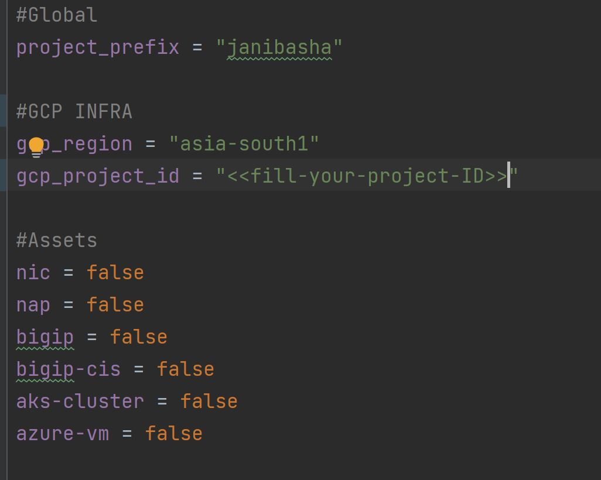
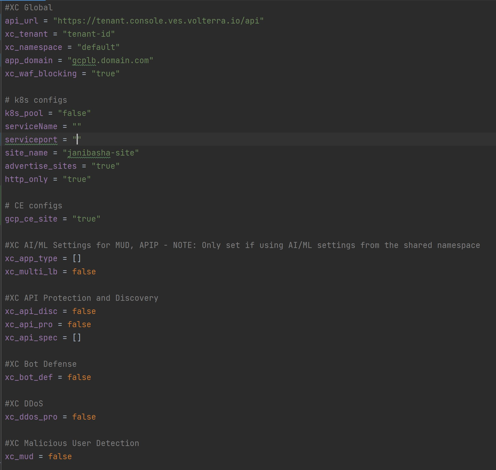
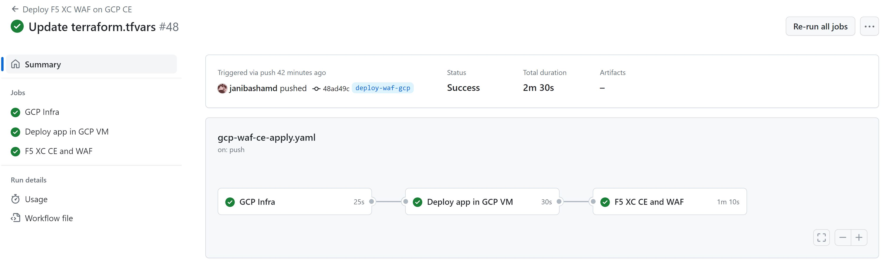
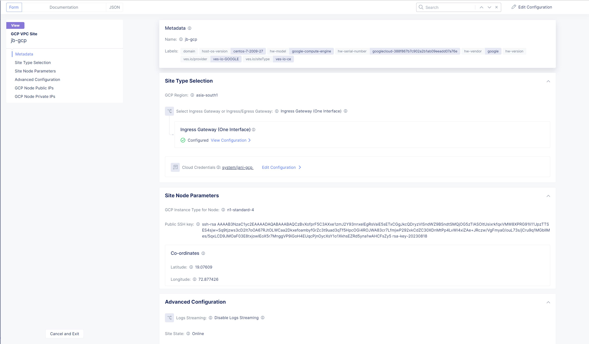
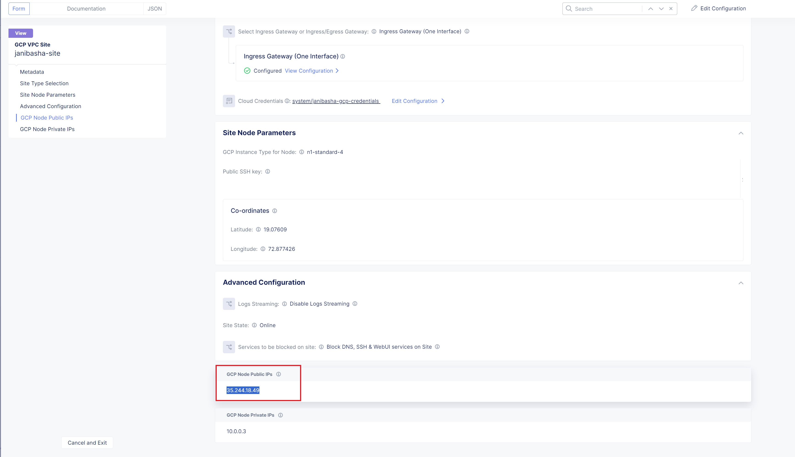
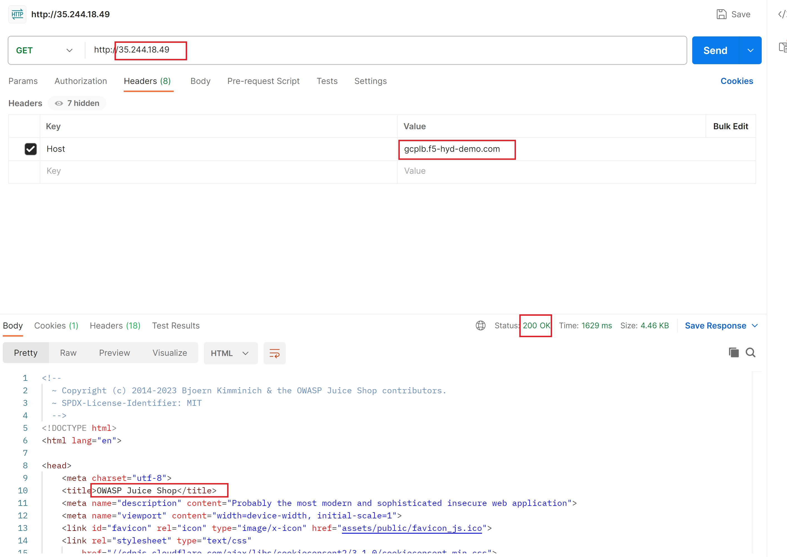

Getting started with WAF on GCP CE terraform automation
---------------

Prerequisites
-------------

-  `F5 Distributed Cloud (F5 XC) Account <https://console.ves.volterra.io/signup/usage_plan>`__
-  `GCP Account <https://cloud.google.com/docs/get-started>`__
-  `Terraform Cloud Account <https://developer.hashicorp.com/terraform/tutorials/cloud-get-started>`__
-  `GitHub Account <https://github.com>`__

List of Existing Assets
-----------------------

-  **xc:** F5 Distributed Cloud WAF
-  **infra:** GCP Infrastructure
-  **App:** Juiceshop demo application

Tools
-----

-  **Cloud Provider:** GCP
-  **IAC:** Terraform
-  **IAC State:** Terraform Cloud
-  **CI/CD:** GitHub Actions

Terraform Cloud
---------------

-  **Workspaces:** Create CLI or API workspaces for each asset in the
   workflow.

   +---------------------------+-------------------------------------------+
   |         **Workflow**      |  **Assets/Workspaces**                    |
   +===========================+===========================================+
   |   deploy-waf-gcp          |   infra, juiceshop, xc                    |
   +---------------------------+-------------------------------------------+

-  **Workspace Sharing:** Under the settings for each Workspace, set the
   **Remote state sharing** to share with each Workspace created.

-  **Variable Set:** Create a Variable Set with the following values and them as sensitive:

   +------------------------------------------+--------------+------------------------------------------------------+
   |         **Name**                         |  **Type**    |      **Description**                                 |
   +==========================================+==============+======================================================+
   |        GOOGLE_CREDENTIALS                | Environment  |  Google credentials file content                     |
   +------------------------------------------+--------------+------------------------------------------------------+
   | VES_P12_PASSWORD                         | Environment  |  Password set while creating F5XC API certificate    |
   +------------------------------------------+--------------+------------------------------------------------------+
   | VOLT_API_P12_FILE                        | Environment  |  Your F5XC API certificate. Set this to **api.p12**  |
   +------------------------------------------+--------------+------------------------------------------------------+
   | ssh_key                                  | TERRAFORM    |  Your ssh key for accessing the created resources    |
   +------------------------------------------+--------------+------------------------------------------------------+
   | tf_cloud_organization                    | TERRAFORM    |  Your Terraform Cloud Organization name              |
   +------------------------------------------+--------------+------------------------------------------------------+

GitHub
------

-  Fork and Clone Repo. Navigate to ``Actions`` tab and enable it.

-  **Actions Secrets:** Create the following GitHub Actions secrets in
   your forked repo

   -  P12: The linux base64 encoded F5XC P12 certificate
   -  TF_API_TOKEN: Your Terraform Cloud API token
   -  TF_CLOUD_ORGANIZATION: Your Terraform Cloud Organization name
   -  TF_CLOUD_WORKSPACE\_\ *<Workspace Name>*: Create for each
      workspace in your workflow per each job

      -  TF_CLOUD_WORKSPACE_INFRA would be created with the
         value ``infra``

      -  TF_CLOUD_WORKSPACE_APP would be created with the
         value ``juiceshop``

      -  TF_CLOUD_WORKSPACE_XC would be created with the
         value ``xc``

Workflow Runs
-------------

**STEP 1:** Check out a branch with the branch name as suggested below for the workflow you wish to run using
the following naming convention.

**DEPLOY**

================             =======================
Workflow                        Branch Name
================             =======================
Deploy F5 XC WAF on GCP CE      deploy-waf-gcp
================             =======================

Workflow File: `gcp-waf-ce-apply.yaml </.github/workflows/gcp-waf-ce-apply.yaml>`__

**DESTROY**

================             =======================
Workflow                        Branch Name
================             =======================
Destroy F5 XC WAF on GCP CE      deploy-waf-gcp
================             =======================

Workflow File: `gcp-waf-ce-destroy.yml </.github/workflows/gcp-waf-ce-destroy.yaml>`__

**STEP 2:** Rename ``gcp/infra/terraform.tfvars.examples`` to ``gcp/infra/terraform.tfvars`` and add the following data:

-  project_prefix = “Your project identifier name in **lower case** letters only - this will be applied as a prefix to all assets”

-  gcp_region = “GCP Region/Location” ex. "asia-south1"

-  gcp_project_id = “User GCP project ID"

-  Also update assets boolean value as shown below

**Step 3:** Rename ``xc/terraform.tfvars.examples`` to ``xc/terraform.tfvars`` and add the following data:

-  api_url = “Your F5XC tenant”

-  xc_tenant = “Your tenant id available in F5 XC ``Administration`` section ``Tenant Overview`` menu”

-  xc_namespace = “The existing XC namespace where you want to deploy resources”

-  app_domain = “the FQDN of your app (cert will be autogenerated)”

-  xc_waf_blocking = “Set to true to enable blocking”

-  k8s_pool = "false"

-  advertise_sites = "set to true"

-  http_only = "set to true"

-  gcp_ce_site = "set to true since we want to deploy GCP CE site"

**STEP 4:** Commit and push your build branch to your forked repo

- Build will run and can be monitored in the GitHub Actions tab and TF Cloud console. If it's failed because of intermittent issue, rerun the work-flow again.

**STEP 5:** Once the pipeline completes, verify your CE, Origin Pool and LB were deployed. (**Note:** CE sites will take 15-20 mins to come online)

**STEP 6:** Once CE site is online and to validate the test infra & demo app accessibility, copy the public IP of CE site in `GCP CE Site View mode` and send a request with XC LB domain as a `Host` header, You should be able to access the demo application as shown in the image below:

**Note:** If you want to destroy the entire setup, checkout a branch with name ``destroy-waf-gcp`` which will trigger destroy workflow and will remove all created resources
