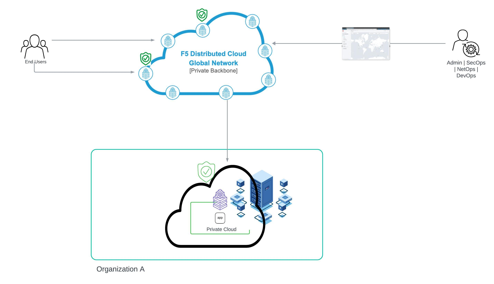

Deploying F5 Distributed Cloud Customer Edge Site on a Bare Metal Hardware in Private Cloud Network
==========================================================================

Introduction
***************
F5 Distributed Cloud (F5 XC) supports deploying its services as a node on bare metal hardware. This capability allows services and applications running on bare metal to connect seamlessly to the F5 XC Global Network, ensuring consistent delivery, security, and performance across diverse distributed infrastructure.

By installing the F5 XC ISO image on bare metal hardware, you can configure it as a Customer Edge (CE) site. This setup helps redirect traffic from the Regional Edge (RE) to the applications deployed behind the CE, providing enhanced security and optimized traffic management. This approach ensures that applications benefit from the robust security features and performance enhancements offered by the F5 XC platform.



Prerequisites
**************
- Access to Distributed Cloud Console SaaS account. 
- Access to any bare metal hardware.
- Install Kubectl command line tool to connect and push the app manifest file to CE. 
- Install postman/web browser to verifying the deployment. 

Step by Step procedure
************************

The steps below explain deploying of F5 XC Services as a site/node in bare metal. 

1. Boot the Hardware with ISO image 
2. Create Site Token and App Stack site object 
3. Configure CE site 
4. F5 XC configs and app deploy 
5. Create Origin Pool & Load Balancer 

Step 1: Booting the Hardware with ISO image
        Download the F5 XC ISO file by going to this `link <https://docs.cloud.f5.com/docs/images/node-cert-hw-kvm-images#images>`__.

        As part of this demo, I am going to deploy this image on Dell iDRAC 9 with INTEL NIC that supports F5 XC ISO deployment. 

        As a prerequisite, make sure the NIC such as Intel, Red Hat, VMware with drivers such as **“hv_netvsc, ena, ixgbe, ixgbe_isv, ixgbevf, e1000e, igb, i40e, e1000, vmxnet3, virtio_net, ice, iavf ”** are available. Since they are supported to deploy ISO image. 
        More information on supported hardware details can be found by going to this `link <https://docs.cloud.f5.com/docs/how-to/site-management/create-baremetal-site>`__.
        
        - Obtain the IP address and log in to the device in which you want to deploy ISO image. 

        .. figure:: Assets/dell_login.jpg

        - Click “Start the Virtual Console” from the iDRAC web interface.

        .. figure:: Assets/start_virtual_console.jpg

        - Click “Virtual Media” and browse to the device that you want to boot the Hardware with. In this demo, I choose ``Map CD/DVD``.

        .. figure:: Assets/launch_virtual_media.jpg

        - Map CD/DVD is chosen for the usage of the ISO image. Click on Choose File button under Map CD/DVD.

        .. figure:: Assets/map_device.jpg

        - Browse to the ISO location, choose the ISO image and then click on Map Device.

        .. figure:: Assets/map_device_2.jpg

        - Click Boot button.

        .. figure:: Assets/boot_button.jpg

        - Choose CD/DVD/ISO.

        .. figure:: Assets/virtual_CD_DVD_boot.jpg

        - Confirm the boot action by clicking yes.

        .. figure:: Assets/select_virtual_CD_DVD.jpg

        - Click on Power button to boot the system with ISO image mapped and click on Yes.

        .. figure:: Assets/warm_boot_selection.jpg

        - The system reboots and shows ``Virtual CD Boot Requested by iDRAC``.

        .. figure:: Assets/boot_process.png

        - A prompt loads with information to install the F5 XC services node OS. Click on Install RHEL 9.

        .. figure:: Assets/RHEL_9_selection.jpg

        - Select the Language and click on Continue.

        .. figure:: Assets/language.jpg

        - Click on Install Destination.

        .. figure:: Assets/automatic_partition.jpg

        - Select the Disk to set as installation destination and then click Done.

        .. figure:: Assets/storage.jpg

        - On the Installation summary page, click Begin Installation.

        .. figure:: Assets/begin_installation.jpg

        .. figure:: Assets/writing_objects.png

        - After the installation process completes, click Reboot System.

        .. figure:: Assets/reboot_system.jpg

        .. figure:: Assets/boot_process_configuring_memory.png

        - After the reboot, system take us to access the node.

        - Log in to the node with the default user credentials admin/Volterra123.

        .. figure:: Assets/ssh_login.jpg

        - After the first log in, we need to update the password as shown below.

        .. figure:: Assets/CE_site_up.png

        This confirms the Site is up and accessible.

        Moving to the next step to create App Stack site.

Step 2: Creating Site Token and App Stack Site object
        **Step 2.1: Creating Site Token**
        
        Login to F5 XC console homepage and navigate to Multi-Cloud Network connect > Manage > Site Management > Site Token. Click ``Add Site token``. In the Name field, enter the token name and enter description. Click on Save and Exit.

        .. figure:: Assets/site_token-2.jpg

        .. figure:: Assets/token-created.jpg

        - Site Token is created successfully.

        **Step 2.2: Creating App Stack Site Object**

        - From F5 XC Console homepage, Select Multi-Cloud Network Connect and navigate to Manage > Site Management > App Stack Sites.

        - Click on Add App Stack Site to open site configuration form.

        .. figure:: Assets/app-stack-site-creation.jpg

        - Provide a name in the Metadata section. Under basic configuration section, From the Generic Server Certificate Hardware menu, select ``dell-edger660-series-voltstack-combo`` since my Hardware is Dell’s iDRAC R660.

        **NOTE:** If you are unable to find the associated Certified Hardware in F5 XC with the hardware you have, talk to the Sales team to proceed further with this. Request must be raised according to the Hardware interface and its network configuration.

        - Enter the name of the master node as ``master-0`` in Master Nodes section.

        - Provide the coordinates: Latitude and longitude of the bare metal HW site. Click on Save and Exit.

        .. figure:: Assets/app-stack-configs.jpg

        - After creating the App Stack site object, the site status shows as Waiting for Registration.

        .. figure:: Assets/site-registration.jpg

Step 3: Configure the CE site
        **Step 3.1: Configuring Network configuration of CE**
        Provide the network configurations for the CE site as mentioned below according to the requirement,

        - Select dhcp enabled as ``Yes``.

        - Select ipv6 enabled as ``Yes``.

        - Choose Primary Interface as ``Outside``.

        - Wifi configs, voltADN, lte were set as ``No``.

        - Select certified hardware for respective device, in this case, it is ``dell-edger660-series-voltstack-combo``.

        - Set Primary outside NIC as ``eno12399``, this is according to interface of the HW, and it should be reachable to outside world.

        .. figure:: Assets/network-configs.jpg

        Enter Y to confirm configuration.

        **Step 3.2: Providing node configurations**

        - Provide the site token created in above step (2.1) from F5 XC console.

        - Enter the name of the site and it should be the same as the App Stack Site object created in step 2.2

        - Provide hostname as master-0 which should be the same as the node name.

        - Enter the latitude and longitude of the CE site location.

        - Select certificate hardware as ``dell-edger660-series-voltstack-combo``.

        - Select primary outside NIC as ``eno12399``.

        - Select registration env as blank.

        .. figure:: Assets/node-configs.jpg

        Enter Y to confirm configuration.

        **Step 3.3: Registration of CE site**

        After the Distributed Cloud Services Node is installed, it must be registered as a site in F5 XC console,

        - Login to F5 XC console. Click on Multi-Cloud Network Connect. Click Manage > Site Management > Registration.

        - Under pending Registration, look for node name and then click on blue checkmark to register the site.

        .. figure:: Assets/registration-pending.jpg

        - Verify the F5 XC Software version is set to default SW version and Operating system version set to Default OS version which means the latest. Click on Save and Exit to accept the registration.

        .. figure:: Assets/registration-save-nexit.jpg

        - Click on Save and Exit to complete site registration.

        .. figure:: Assets/other-registration.jpg

        Confirm site deployed and online by navigating to Multi-Cloud Network Connect > Sites.

        - CE site takes a few minutes to come to online state along with OS versions, SW version sections values show successful.

        .. figure:: Assets/site-online-dashboard.jpg

        CE site is online and ready to perform application deployment operations.

Step 4: F5 XC config and app deploy
        **Step 4.1: Creating and Assigning labels to the Site**
        Labels are created to group multiple CE sites together to create a virtual site. A Virtual site provides a mechanism to perform operations on an individual or a group of sites.

        - From F5 XC console > select Shared configuration box.

        - Select Manage in left menu > select Labels > Known keys and select Add known key button.

        .. figure:: Assets/labels.jpg

        - Enter label key name and value for the key. Click on the Add key button to create key-value pair.

        - Navigating to Multi-Cloud Network Connect > Site Management > App Stack Sites. Select the site to which labels need to be assigned and click on Manage configuration.

        .. figure:: Assets/label-manage-configs.jpg

        - Click on Edit configuration on the top right corner to make config changes to the site. 

        - Click on Add Labels in Labels section and add the key-value pair created above.

        .. figure:: Assets/labels-to-site.jpg

        - Click on Save and Exit.

        **Step 4.2: Creating Virtual Site and vK8s object**

        - From F5 XC Console homepage, Click on Shared configuration. Click Manage > Virtual Sites and click on “Add Virtual Site”.

        - In the Site Type select CE. From the selector Expression field, lick Add Label to provide the custom key created previously along with operator ``In``, followed by custom values as shown below. Click on Save and Exit.

        .. figure:: Assets/virtual_site.jpg

        - From F5 XC Console Homepage, click on Distributed apps. Select Applications > Virtual k8s. Click on “Add Virtual K8s” to create a vK8s object.

        - In the Virtual Sites section, select Add item and then select a virtual site created above from the drop-down menu.

        .. figure:: Assets/vk8s_object.jpg

        - Click on Save and Exit to create vK8s object.

        - Select ``…``` > kubeconfig for the vK8s object to download the Kubeconfig file.

        .. figure:: Assets/download_kubeconfig_file.jpg

        - Deploy the application on bare metal CE using the kubeconfig file for the vK8s object created above.

        .. figure:: Assets/download_kubeconfig_file.jpg

Step 5: Creating Origin Pool and Load Balancer
        **Step 5.1: Creating Origin Pool**

        - Creating an origin pool for application deployed in private cloud on the CE site.

        .. figure:: Assets/origin_pool.jpg

        - Created a Load Balancer and assigned Origin Pool to the Load Balancer to access the application.

        .. figure:: Assets/load_balancer.jpg

        - Application is accessible.

        .. figure:: Assets/app_accessibility.jpg

         Created a WAF policy with Enforcement mode as blocking and assigned it to the Load Balancer.

        .. figure:: Assets/waf_firewall.jpg

        When a client requests forceful browsing of exe file, which is a file type violation, it triggers the security event, and the request gets blocked by XC WAF.

        .. figure:: Assets/waf_block_request.jpg


Conclusion
**************
As described in this demo, bare metal hardware can be transformed into an F5 Distributed Cloud CE, allowing you to deploy applications while ensuring consistent delivery, security, and performance for the apps running on it.

For more detailed guidance and steps on how to deploy and configure F5 XC on bare metal, refer to the official documentation and resources provided by F5.

Create Baremetal Site | F5 Distributed Cloud Tech Docs (https://docs.cloud.f5.com/docs/how-to/site-management/create-baremetal-site) 


        


        


        


        


        


        


