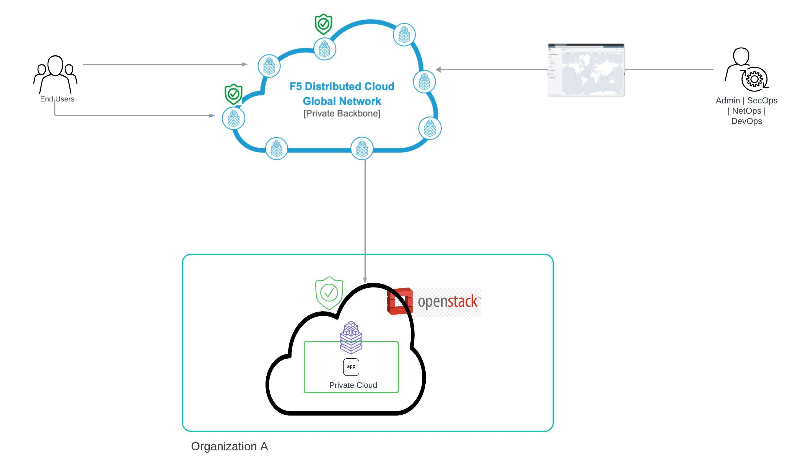

Deploying F5 XC’s Customer Edge using KVM on Openstack’s Private Cloud 
==========================================================================

Introduction
***************

As there is a drastic change in deploying application from traditional data centers to the Hybrid Cloud in recent times. Companies are deploying their apps in the environment that made the most sense for the applications. Hence there is a greater demand in distribution of applications in multiple public cloud, traditional data centers, Private cloud, and edge as well.  

There are certain apps that are residing in environment (like private cloud) needs to be connected to other environment such as multi-cloud networking platforms for better transit of data with greater security measures along with low latency and this can be achieved using F5 Distributed Cloud (F5 XC). 

Solution overview
*******************

In this article, we demonstrate deploying F5 XC Services site as a Customer Edge (CE) on KVM in Open Stack private cloud network. We also deploy an application and connect the CE to the F5 XC’s Global network. This results in extending the F5 XC’s global backbone network to the customer premises to provide security capabilities along with telemetry. 

Step by Step procedure
************************

F5 XC services support site deployment for a Kernel-based Virtual Machine (KVM) as a node and to perform site registration on F5 XC console. Below are the steps mentioned,

1. Deploy CE on OpenStack
2. Configure CE site
3. F5 XC configs and app deploy 
4. Create Origin Pool & Load Balancer

1.   Deploy CE on OpenStack:
      **Step 1.1**: Creating Site Token
      Login to F5 XC console home page and navigate to Multi-Cloud Network connect > Manage > Site Management > Site Token. Click “Add Site token” and create a site token.
      .. figure:: Assets/open-stack.jpg

