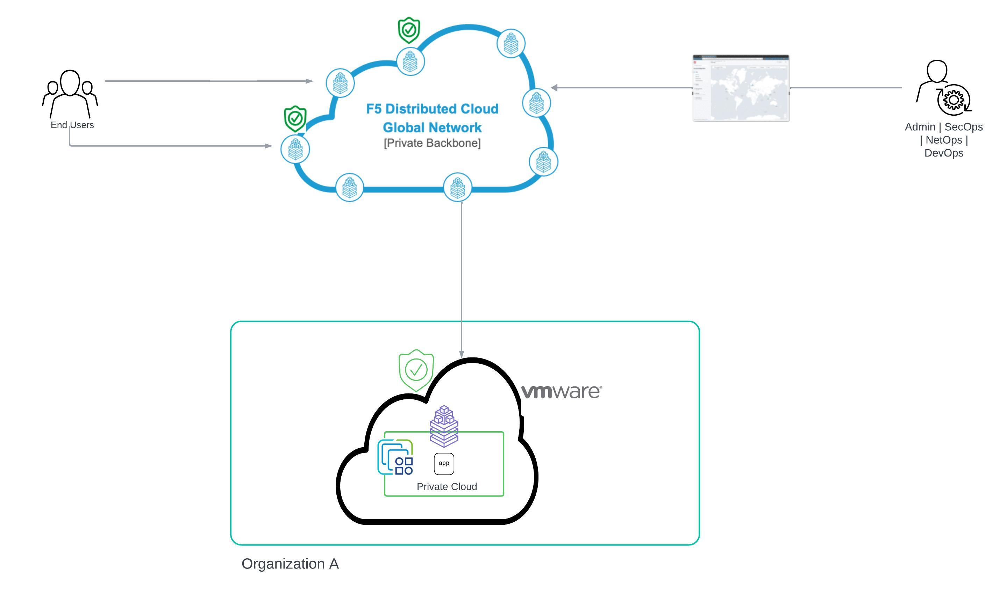

Deploying F5 XC’s Customer Edge using ESXi on VMware Private Cloud Edge
==========================================================================

Introduction
***************
F5 Distributed Cloud (F5 XC) supports deploying its services as a node in VMware environment. This helps to connect services/applications running on VMware based on-premises environment to F5 XC Global Network and deliver consistent security.

This expands application deployed in VMware to connect across services running in multiple public cloud platforms. 

Solution overview
*******************
In this article, we demonstrate deploying F5 XC services as a Customer Edge (CE) on VMware ESXi hypervisor and connect the CE to the F5 XC’s Global network. We also deploy a dummy Flight booking application designed to book flights.  

Prerequisites
**************
- Distributed Cloud Console SaaS account.
- Access to VMware ESXi Host Client
- Install Kubectl command line tool to connect and push the app manifest file to CE
- Install postman for verifying the deployment

Step by Step procedure
************************

The steps below explain deploying of F5 XC Services as a site/node in customer premises by deploying a virtual machine on VMware ESXi. 

1. Create Site Token & App Stack site object 
2. Deploy site on VMware ESXi
3. F5 XC configs and app deploy
4. Create Origin Pool & Load Balancer

Below we shall take a look into detailed steps,

1.   Create Site Token & App Stack Site object:
      **Step 1.1: Creating Site Token**
      - Login to F5 XC console home page and navigate to Multi-Cloud Network connect > Manage > Site Management > Site Token. Click ``Add Site token``.
      - In the Name field, enter the token name and enter description. Click on Save and Exit.

      .. figure:: Assets/token_creation.jpg

      .. figure:: Assets/site-token-vmware.jpg

      **Step 1.2: Creating App Stack Site Object**   

      - From F5 XC Console homepage, Select Multi-Cloud Network Connect and navigate to Manage > Site Management > App Stack Sites.
      - Click on Add App Stack Site to open site configuration form.
 
      .. figure:: Assets/site-creation.jpg

      - Provide a name in the Metadata section. Under basic configuration section, From the Generic Server Certificate Hardware menu, select ``vmware-voltstack-combo``. 
      - Enter the name of the master node as ``master-0`` in Master Nodes section.
      - Provide the coordinates: Latitude and longitude of the VMware site. Click on Save and Exit.

      .. figure:: Assets/site-configuration.jpg

      - After creating the App Stack site object, the site status shows as Waiting for Registration.

      .. figure:: Assets/wait-fr-register.jpg

2.   Deploy Site on VMware ESXi:
      **Step 2.1: Install the Node on VMware ESXi Hypervisor**

      Login to VMware ESXi portal.

      .. figure:: Assets/vmware-login.jpg

      - Click on Create/Register VM from Virtual Machines section.

      .. figure:: Assets/create-vm.jpg

      - Select Deploy a virtual machine from an OVF or OVA file from the options listed and click on Next.

      .. figure:: Assets/ova-ovf.jpg

      - Enter Virtual Machine name and click to select the OVA file to boot the VM. Click on Next.

      - F5 XC Services VMware OVA file can be downloaded by going to this `link <https://docs.cloud.f5.com/docs/images/node-vmware-images#vmware-images>`__.

      .. figure:: Assets/vs-name_image.jpg
      
      - Select the storage as required based on the storage available on the hypervisor host. Click on Next.

      .. figure:: Assets/storage-vmware.jpg

      - Select the Network to which VM should be connected to. Disk provisioning is set to thin provisioning as default. Click on Next.

      .. figure:: Assets/network-vmware.jpg

      These parameters enable the machine to request registration directly to the F5 XC console.

      - Provide Hostname as ``master-0`` which should be same as Node name mentioned in step 1.2
      - Enter the token created in step 1.1 
      - Enter the Admin password and re-enter in Admin password confirm field.
      - Set the cluster name as ``chthonda-vmware-sjc`` which should be same as App Stack Site object name created in step 1.2
      - Scroll down to Enter Certificate Hardware as ``vmware-voltstack-combo``.
      - Enter latitude and longitude of the VMware site. Click on Next.

      .. figure:: Assets/additional_settings-new.jpg

      .. figure:: Assets/additional_settings-2.jpg

      - Click on Finish to boot the VM with uploaded OVA file.

      .. figure:: Assets/wizard-configs.jpg
      
      virtual machine is built and booted.

      **Step 2.2: Register the VMware site**

      After the F5 XC Services Node is installed in VMware, it must be registered as a site in F5 XC Console.

      - From F5 XC home page, Navigate to Multi-Cloud Network Connect > Manage > Site Management > Registration. 
      - Under pending registration, find the node name and click on blue checkmark to verify the form related to VMware site.

      .. figure:: Assets/registration.jpg

      - Verify the F5 XC Software version is set to default SW version and Operating system version set to Default OS version which means the latest. Click on Save and Exit to accept the registration.

      .. figure:: Assets/registration-form.jpg

      -  Site state shows Approval Started.

      .. figure:: Assets/site-online.jpg

      Confirm site deployed and online by navigating to Multi-Cloud Network Connect > Sites.

      - It takes a few minutes for the site to come to online state along with OS version, SW version section values shows successful.

      .. figure:: Assets/site-up-active.jpg

3.   F5 XC configs and app deploy
      **Step 3.1: Creating & Assigning labels to Site**

      Labels are created to group multiple CE sites together to create a virtual site. A Virtual site provides a mechanism to perform operations on an individual or a group of sites.

      - From F5 XC console > select Shared Configuration box.
      - Select Manage in left-menu > select Labels > Known Keys and select ``Add known key`` button.
      
      .. figure:: Assets/labels.jpg

      - Enter Label key name and value for the key. Click on ``Add key button`` to create key-value pair.
      - Navigating to Multi-Cloud Network Connect > Site Management > App Stack Sites. Select the site to which labels need to be assigned and click on Manage Configuration.

      .. figure:: Assets/site-mgmt.jpg

      - Click on Edit configuration on the top right corner to make config changes to the site.
      - Click on Add Label in Labels section and add the key-value pair created above.

      .. figure:: Assets/labels-to-site-2.jpg

      - Click on Save and Exit.

      **Step 3.2: Creating Virtual Site & vK8s object**

      - From F5 XC Console homepage, Click on Shared Configuration. Click Manage > Virtual Sites and click on ``Add Virtual Site``.
      - In the Site Type select CE. From the Selector Expression field, click Add Label to provide the custom key created previously along with operator ``==``, followed by custom value as shown below. Click on Save and Exit.

      .. figure:: Assets/virtual-site.jpg

      - From F5 XC Console Homepage, Select Distributed apps. Select Applications > Virtual k8s. Click on ``Add Virtual K8s`` to create a vK8s object.
      - In the Virtual Sites section, select Add item and then select a virtual site created above from the drop-down menu.

      .. figure:: Assets/k8s-cluster.jpg

      - Click on Save and Exit to create vK8s object. Select ``...`` > ``Kubeconfig`` for the vK8s object to download the Kubeconfig file.

      .. figure:: Assets/vk8s-object.jpg

      - Deploy the application on VMware EXSi using the kubeconfig file for the vK8s object created above.

      .. figure:: Assets/app-deploy-2.jpg 

4.   Creating Origin Pool and Load Balancer
      **Step 4.1: Creating Origin Pool **

      - Creating an origin pool for application deployed in private cloud on the CE site.

      .. figure:: Assets/origin-pool.jpg

      - Created a Load balancer and assigned Origin Pool to the Load Balancer to access the application.

      .. figure:: Assets/load-balancer.jpg

      - Application is accessible.

      .. figure:: Assets/app-access.jpg

      Created a WAF policy with enforcement mode as blocking and assigned this to the Load Balancer.

      .. figure:: Assets/waf-policy.jpg

      - When a client requests forceful browsing of exe file, which is the file type violation, it triggers a security event, and the request gets blocked by XC WAF.

      .. figure:: Assets/request-block.jpg

Conclusion
**************
Integrating F5 XC services with VMware results in delivering consistent security and performance for apps running on VMware. This integration connects application services running on VMware Private cloud to multiple public cloud providers.        

    