Deploying F5 XC WAF on RE + AppConnect
--------------

.. contents:: Table of Contents

Overview
#########
This guide provides detailed manual configuration steps for WAF (on RE )+ App Connect scenarios along with the terraform scripts to automate the deployment which helps users in configuring CE (Customer Edge) sites, connect the application which is not accessible from the internet and access it securely using F5 Distributed Cloud. For more details on WAF series, please refer to  `Deploy WAF Anywhere Overview Article <https://community.f5.com/t5/technical-articles/deploy-waap-anywhere-with-f5-distributed-cloud/ta-p/313079>`_

Below two scenarios of deploying application in different resources are covered in thie guide.

1. Deploy application in Virtual Machine.

2. Deploy application in Kubernetes Cluster.

**Note**: Automation scripts and steps will be attached soon. Even though the scenario here focuses on XC WAF, customers can enable any security services in the same setup, such as API Security, Bot Defense, DoS/DDOS and Fraud, as per their needs.

Setup Diagram
#############
Below are the workflow diagrams for two different usecases depending on the way the application is deployed in backend:

**Workflow Representation when application is deployed in Azure VM:**

.. figure:: assets/WAAP-on-RE-AppConnect-vm.png

**Workflow Representation when application is deployed in Azure Kubernetes Cluster:**

.. figure:: assets/WAAP-on-RE-AppConnect-K8s .png

Workflow Instructions
######################

`F5 Distributed Cloud Console Workflow <./xc-console-demo-guide.rst>`__

`F5 Distributed Cloud Automation Workflow <./automation-demo-guide.rst>`__

Manual step-by-step deployment process:
##############################################

Pre-requisites
==============

- Access to Azure subscription. 
- Access to F5 Distributed Cloud account.
- Web browser to access the application.

Step 1: Configure credentials in F5 Distributed Cloud Console for Azure
=======================================================================
To deploy an Azure Vnet site from F5XC, first we have to configure cloud credentials in XC. Please refer `DevCentral Article <https://community.f5.com/t5/technical-articles/creating-a-credential-in-f5-distributed-cloud-for-azure/ta-p/298316>`_ and follow the steps to configure. 

Step 2: Deploy Azure Vnet site 
==============================

* Login to F5XC Console and navigate to "Multi-Cloud Network Connect" from the homepage. 

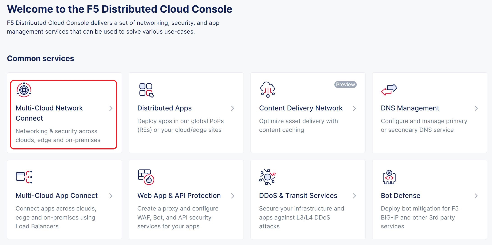

* Select "Manage > Site Management > Azure VNET Sites" and click on "Add Azure VNET Site". 

* Give a Vnet site name you wish to create in “Name” field, resource group name in the “Resource Group” field. Do not provide an already existing resource group name. 

* Choose appropriate Azure region from the common value recommendations where the resources will be deployed. 

* Select New Vnet Parameters and provide the Vnet details like name, IPv4 CIDR block (Ex: 10.0.0.0/16.)

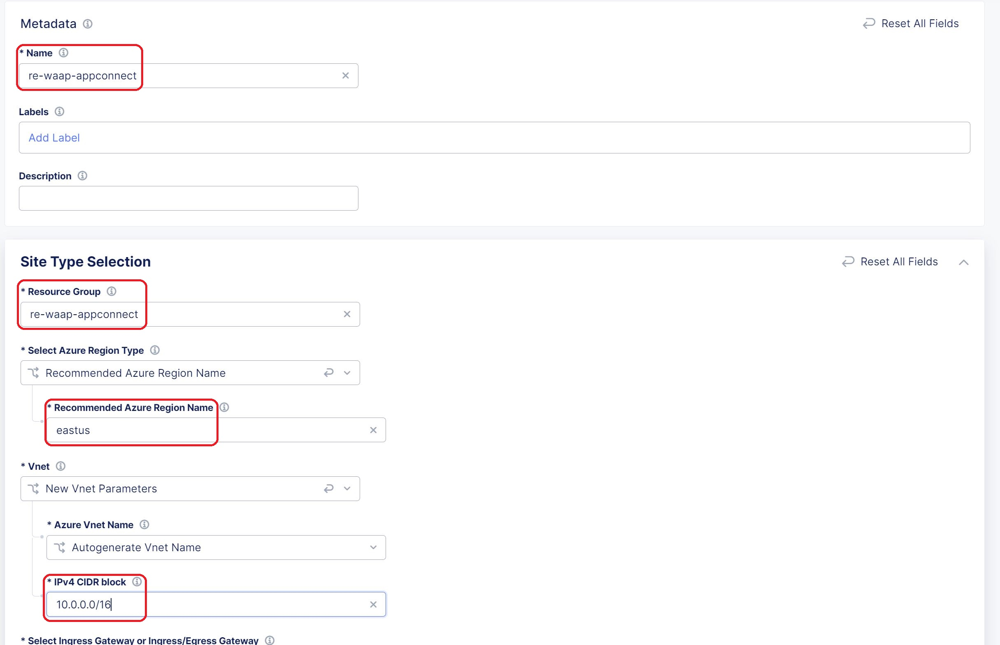

* Choose Ingress Gateway (One Interface), click on Configure then click Add Item in Ingress Gateway (One Interface) Nodes in AZ. 

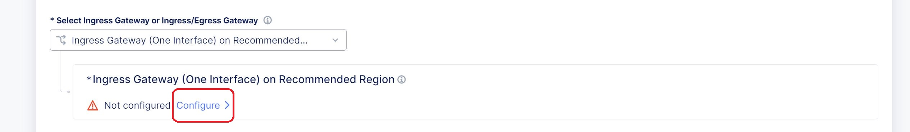

* Choose the appropriate Azure AZ name from the dropdown. In IPv4 Subnet, enter a new subnet address (Ex: 10.0.1.0/24) then click on Apply to save node settings. 

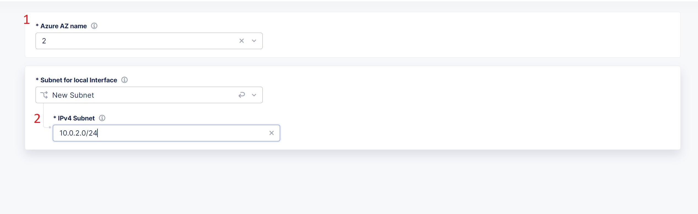

* Select the Azure cloud credentials from the dropdown menu which was configured in Step 1. 

* Add a public SSH key to access the site. (If you don’t have public SSH key, you can generate one using “ssh-keygen” command and then display it with the command “cat ~/.ssh/id_rsa.pub”). 

* In Advanced Configuration, select Show Advanced Fields then choose Allow access to DNS, SSH services on Site from the dropdown. 

* Click Save and Exit. 

* Click on Apply in Actions column. 

* Wait for the apply process to complete and the status to change to Applied. 

Step 3: Create resource and deploy an application 
=================================================
We can create any resource in the backend to deploy our application. User can choose any scenario from below to deploy the application according to their need.

Note: Main requirement for this use case is that the application should not be accessible from Internet which means VM or the cluster node should not have public IP/FQDN. 

Create Virtal Machine and deploy application in it
***************************************************

* Login to the Azure portal with your credentials. 

* Search for the “Resource groups” and open your resource group which was created by F5XC in Step 2.  

* Click on Create and create a new Virtual Machine. In this demo guide, we have used Ubuntu Server 20.04. 

* While creating Virtual machine, make sure to select the correct subscription and same resource group which was created in step 2. 

* Provide all the necessary details in Basics Section like Name of the VM, Region, Availability Zone, Image, Size, Username, Key pair name, Inbound port rules.  

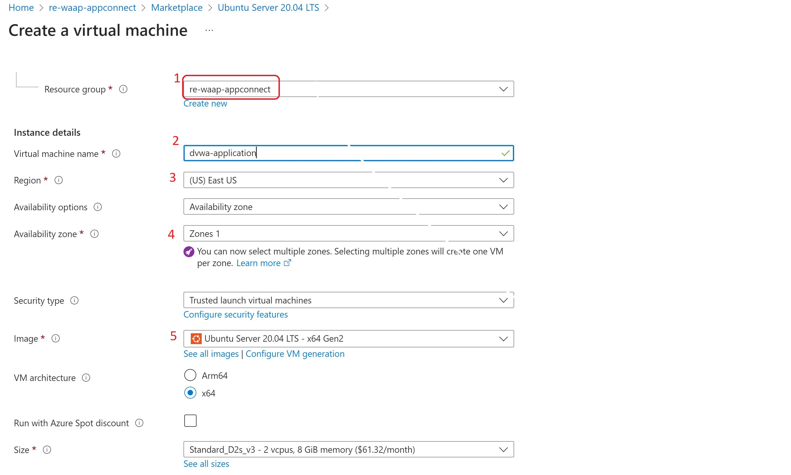

* Navigate to Networking section, select the Vnet site in Virtual network and Subnet which was created in step 2. 

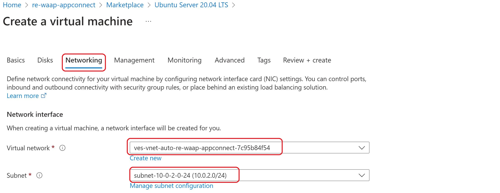

* Click on “Review and Create”, Review all the necessary parameters and deploy a Virtual Machine.   

* Login to created Virtual Machine using Public IP and install docker in it.

* Choose the application you want to use and deploy the application within Virtual Machine. In this scenario, we have deployed DVWA application for testing purpose using below docker command. 

   "docker run -d -p 80:80 vulnerables/web-dvwa"

* We should not have a Public IP address for the VM so disassociate the existing public IP address from the VM and delete it. 

* Make a note of the private IP of the virtual machine. 

Create Kubernetes Cluster and deploy application in it
******************************************************

* Login to Azure account and search for “Kubernetes services”.

* Click on Create button and select Create Kubernetes cluster.

* Select the correct subscription and add the same resource group as that of Azure Vnet CE site.

* Provide all the necessary cluster details and primary node pool fields as needed.

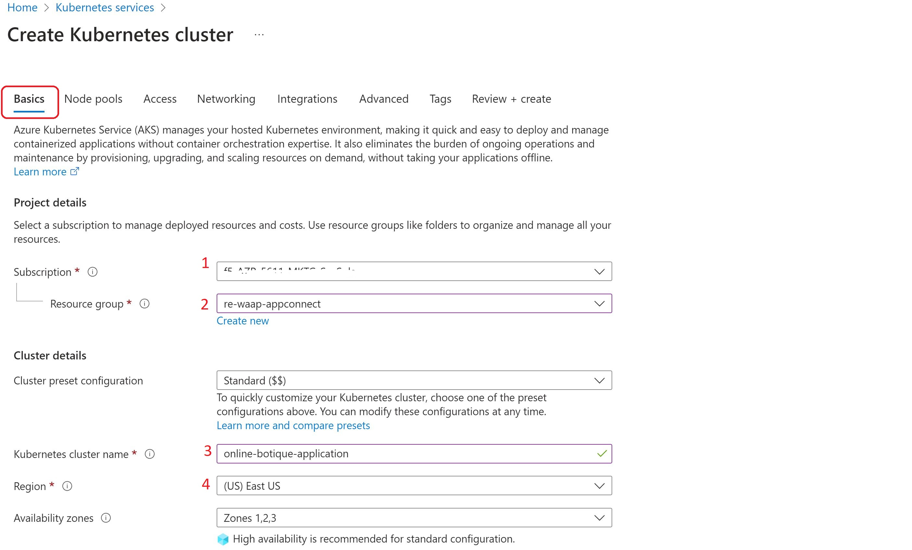

* Navigate to “Networking” tab and select “Network configuration” as Azure CNI.

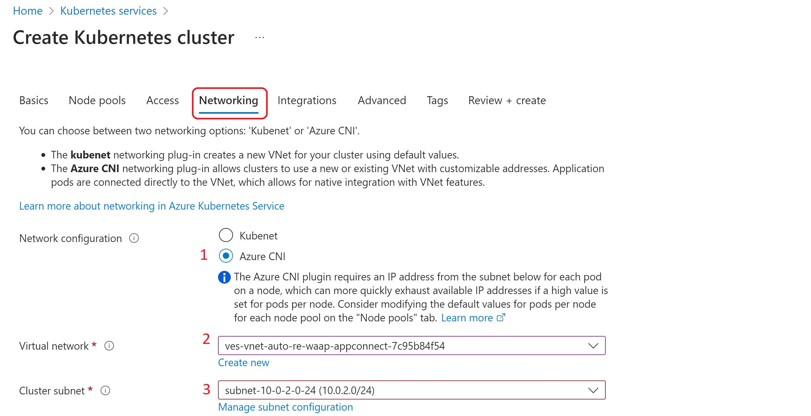

* Select the same Virtual network as that of your Azure Vnet site.

* Click “Review + create” and create the cluster.

* Connect to the created AKS cluster.  

* Choose your application and deploy it. In this scenario, we are deploying Online boutique application using the `manifest file <https://github.com/GoogleCloudPlatform/microservices-demo/blob/main/release/kubernetes-manifests.yaml>`_. Make changes in the manifest file according to the requirement.

* Execute “kubectl apply -f <your_manifest.yaml>”

* Execute “kubectl get pods” command to check the deployment status of the pods.

.. figure:: assets/pod_details.JPG

* Execute “kubectl get node -o wide” command and make a note of the private IP of the node and internal port of the frontend service.

.. figure:: assets/service_details.JPG

Step 4: Configure HTTP Load Balancer in F5XC console 
====================================================

* In F5XC console, Navigate to Multi-Cloud App Connect service. 

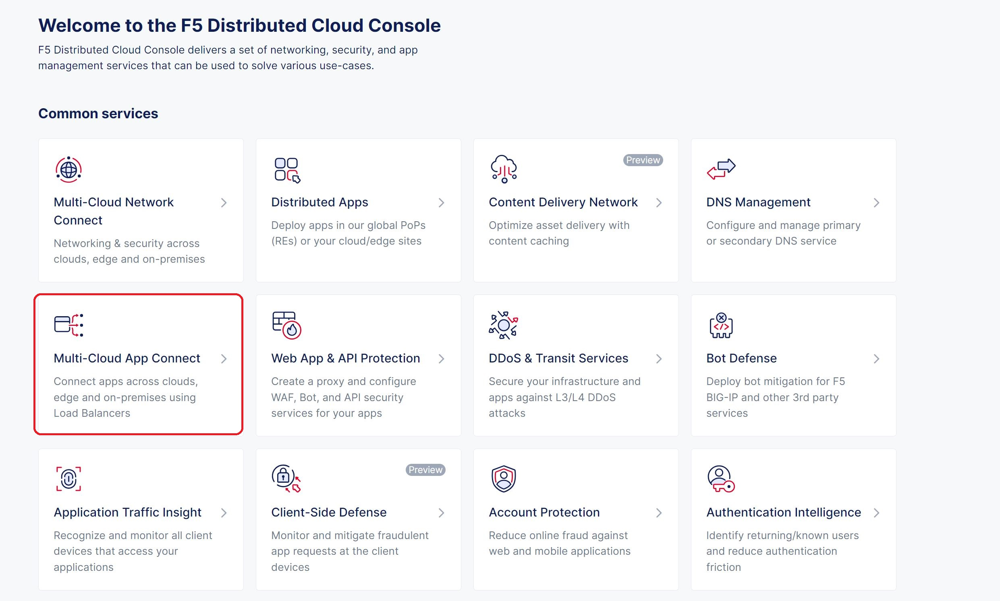

* Select Manage > Load Balancers > HTTP Load Balancers and click Add HTTP Load Balancer. 

* Provide a name for the new load balancer and in the Domains field, enter the name of the domain to be used with this load balancer 

* From the Load Balancer Type drop-down menu, select HTTP Load Balancer. 

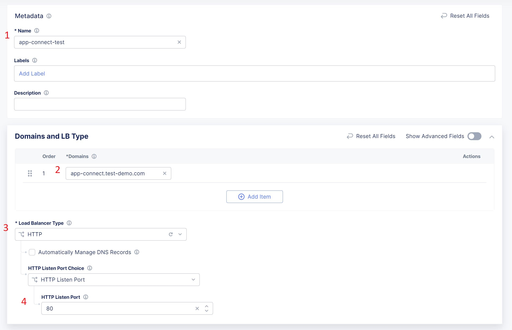

* Move to Origin Pools section and click Add Item. 

* From the Origin Pool drop-down menu, Click Add Item. 

* Enter name for the origin pool then click Add Item under origin server section 

* Select “IP address of Origin Server on given Sites”, provide the private IP of the virtual machine or Cluster node which you have deployed in Step 3, Choose Azure Vnet Site in Site dropdown same as your Vnet site, choose Outside Network under Select Network from the Site.

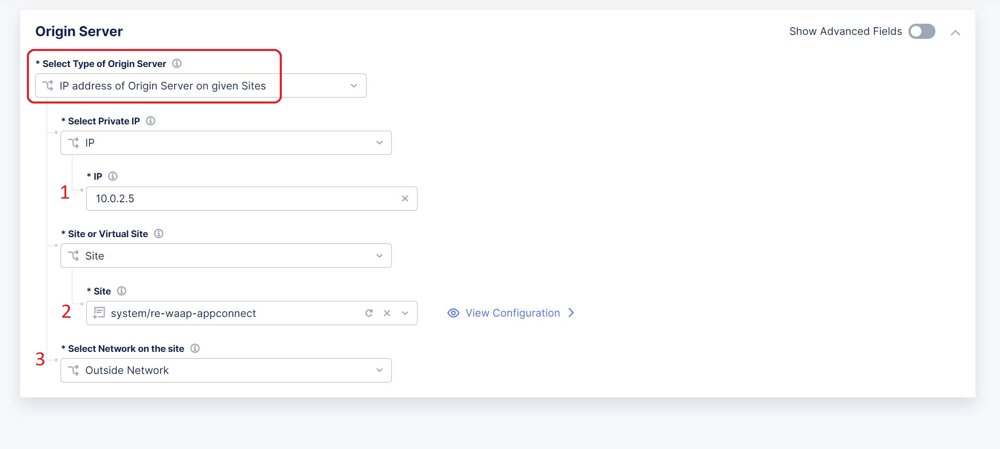

* Click on Apply. 

* In Origin server port, provide the port of the deployed application. 

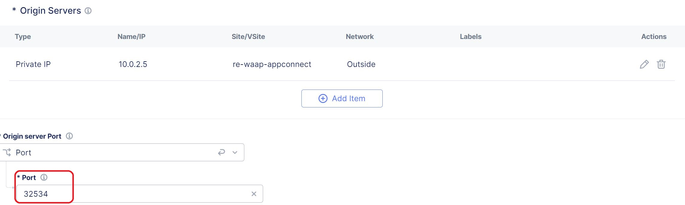

* Click Continue and then Apply. 

* In Load Balancer page, Enable WAF and use a WAF blocking policy

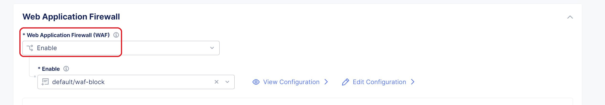

* Move to VIP Advertisement field and choose Internet. 

* Complete creating the load balancer by clicking Save and Exit. 

Step 5: Access the deployed application 
=======================================
* Open a browser. 

* Access the application using the domain name configured in HTTP load balancer. 

* Make sure that the application is accessible.

* Now let us verify applied WAF policy

* Generate a XSS attack by adding ?a=<script> tag in the URL along with the domain name and observe that WAF policy blocks the access.

* Application should not be accessible

Conclusion
##########
By following the above provided steps, one can easily configure WAAP(on RE)+Appconnect usecase where CE sites are configured and connected to the closest two REs through IPSEC tunnels. When end user is trying to access the backend private application, they will connect to their closest RE and the request will be inspected by the WAAP security policy. From there, the request will be traversed over XC Global Network and reach the respective CE site through IPSEC tunnel which in turn communicates with the backend application and provides the necessary data.

