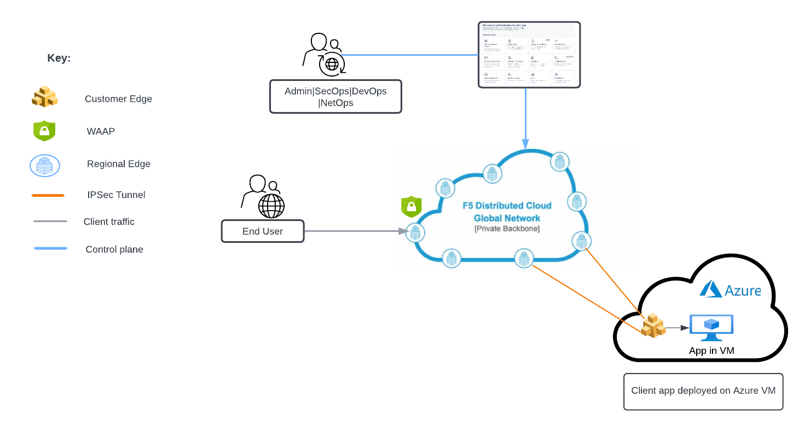

Deploying F5 XC WAF on RE + AppConnect in Virtual Machine
-------------------------------------

.. contents:: Table of Contents

Overview
#########
This guide provides detailed manual steps along with the terraform scripts to automate the deployment for WAF (on RE)+ AppConnect scenario in which application is deployed in Virtual Machine. This helps users in configuring CE (Customer Edge) sites, connect the application which is not accessible from the internet and access it securely using F5 Distributed Cloud. For more details on WAF series, please refer to  `Deploy WAF Anywhere Overview Article <https://community.f5.com/t5/technical-articles/deploy-waap-anywhere-with-f5-distributed-cloud/ta-p/313079>`_

**Note**: Even though the scenario here focuses on XC WAF, customers can enable any security services in the same setup, such as API Security, Bot Defense, DoS/DDOS and Fraud, as per their needs.

Setup Diagram
#############

Workflow Instructions
######################

`F5 Distributed Cloud Console Workflow <./vm-manual-demo-guide.rst>`__

`F5 Distributed Cloud VM Automation Workflow <./vm-automation-demo-guide.rst>`__
