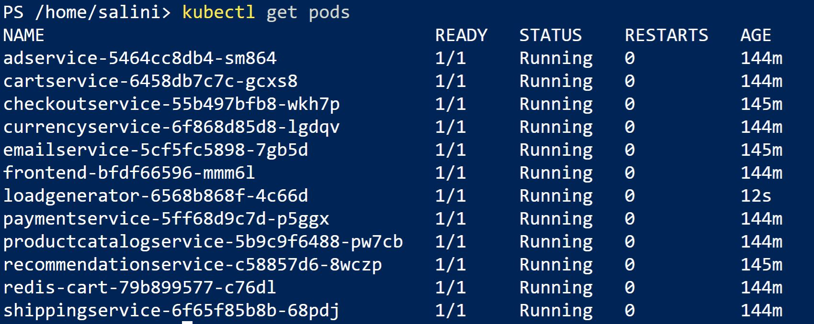

Manual step by step deployment process:
===============================================

Pre-requisites
===========================================
- Access to Azure subscription. 
- Access to F5 Distributed Cloud account.
- Install Azure CLI and kubectl command line tool to connect and push the app manifest file to AKS cluster
- Web browser to access the application.

Step 1: Configure credentials in F5 Distributed Cloud Console for Azure
=======================================================================
To deploy an Azure Vnet site from F5XC, first we have to configure cloud credentials in XC. Please refer `DevCentral Article <https://community.f5.com/t5/technical-articles/creating-a-credential-in-f5-distributed-cloud-for-azure/ta-p/298316>`_ and follow the steps to configure. 

Step 2: Create Resource group, Vnet and Subnet in Azure 
===================================================================

* Login to Azure console and search for "Resource groups"
* Click on Create button, select your subscription, add the resource group name and region
* Click “Review + create” and "Create"
* Search for "Virtual networks" and click Create button
* Select your subscription, set the above created resource group name, virtual network name and region
* Navigate to IP addresses tab, Configure your virtual network address space and subnet
* Click “Review + create” and "Create"

Step 3: Create resource and deploy an application 
=================================================
This guide explains two diffrent scenarios of deploying application. User can choose any scenario from below to deploy the application according to their need.

1. Create Virtual Machine and deploy application in it.

2. Create Kubernetes Cluster and deploy application in it.

Note: Main requirement for this use case is that the application should not be accessible from Internet which means VM or the cluster node should not have public IP/FQDN.

Create Virtal Machine and deploy application in it.
##########################################################

* Login to the Azure portal with your credentials.
* Click on Create and create a new Virtual Machine. In this demo guide, we have used Ubuntu Server 20.04.
* While creating Virtual machine, make sure to select the correct subscription and same resource group which was created in step 2.
* Provide all the necessary details in Basics Section like Name of the VM, Region, Availability Zone, Image, Size, Username, Key pair name, Inbound port rules. 
* Navigate to Networking section, select the Virtual network and Subnet which is created in step 2.
* Click on “Review and Create”, Review all the necessary parameters and deploy a Virtual Machine.
* Login to created Virtual Machine using Public IP and install docker in it.
* Choose the application you want to use and deploy the application within Virtual Machine. In this scenario, we have deployed DVWA application for testing purpose using below docker command.
"docker run -d -p 80:80 vulnerables/web-dvwa"

* We should not have a Public IP address for the VM so disassociate the existing public IP address from the VM and delete it.
* Make a note of the private IP of the virtual machine.

Create Kubernetes Cluster and deploy application in it.
###########################################################
* Login to Azure account and search for “Kubernetes services”.
* Click on Create button and select Create Kubernetes cluster.
* Select the correct subscription and choose the resource group which is created in step 2.
* Provide all the necessary cluster details and primary node pool fields as needed.
* Navigate to “Networking” tab and select “Network configuration” as Azure CNI.
* Select the Virtual network which is created in step 2.
* Click “Review + create” and create the cluster.
* Connect to the created AKS cluster.  
* Choose your application and deploy it. In this scenario, we are deploying Online boutique application using the `manifest file <https://github.com/GoogleCloudPlatform/microservices-demo/blob/main/release/kubernetes-manifests.yaml>`_. Make changes in the manifest file according to the requirement.
* Execute “kubectl apply -f <your_manifest.yaml>”
* Execute “kubectl get pods” command to check the deployment status of the pods.

Step 4: Deploy Azure Vnet site from F5XC console:
==================================================

* Login to F5XC Console and navigate to "Multi-Cloud Network Connect" from the homepage.
* Select "Manage > Site Management > Azure VNET Sites" and click on "Add Azure VNET Site".
* Give a Vnet site name you wish to create in “Name” field, resource group name in the “Resource Group” field. Do not provide an already existing resource group name.
* Choose appropriate Azure region from the common value recommendations.
* Select Existing Vnet Parameters and provide the Vnet details like resourge group and Vnet name which was created in step 2. 
* Choose Ingress Gateway (One Interface), click on Configure then click Add Item in Ingress Gateway (One Interface) Nodes in AZ. 
* Select the Azure cloud credentials from the dropdown menu which was configured in Step 1. 
* Add a public SSH key to access the site. (If you don’t have public SSH key, you can generate one using “ssh-keygen” command and then display it with the command “cat ~/.ssh/id_rsa.pub”). 
* In Advanced Configuration, select Show Advanced Fields then choose Allow access to DNS, SSH services on Site from the dropdown. 
* Click Save and Exit. 
* Click on Apply in Actions column. 
* Wait for the apply process to complete and the status to change to Applied. 
