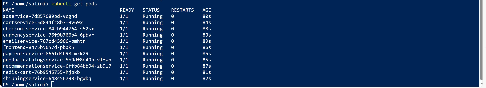
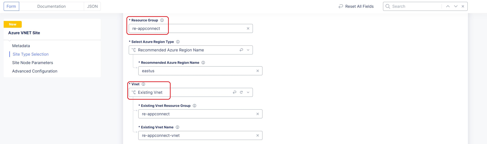
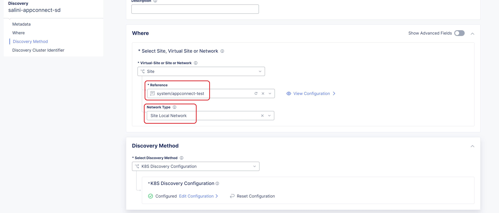
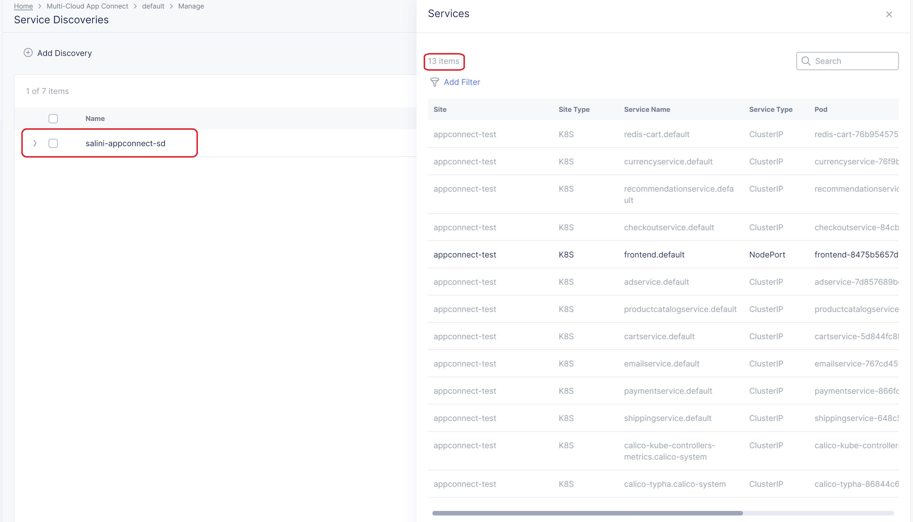
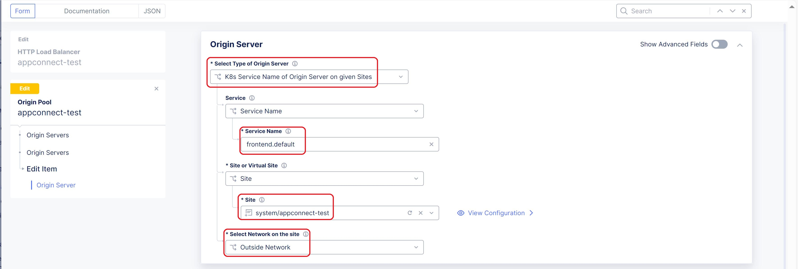
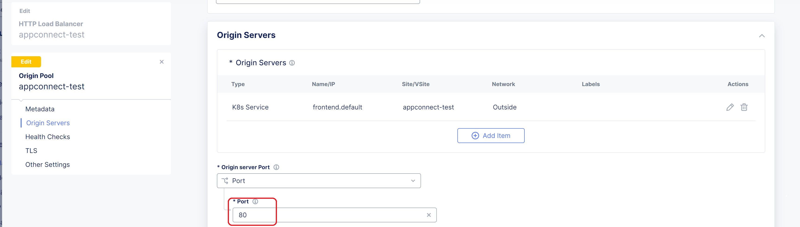
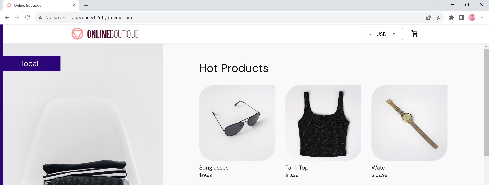

Manual step by step deployment process:
===============================================

Pre-requisites
******************
- Access to Azure subscription. 
- Access to F5 Distributed Cloud account.
- Install Azure CLI and kubectl command line tool to connect and push the app manifest file to AKS cluster
- Web browser to access the application.

Step 1: Configure credentials in F5 Distributed Cloud Console for Azure
#########################################################################
To deploy an Azure Vnet site from F5XC, first we have to configure cloud credentials in XC. Please refer `DevCentral Article <https://community.f5.com/t5/technical-articles/creating-a-credential-in-f5-distributed-cloud-for-azure/ta-p/298316>`_ and follow the steps to configure. 

Step 2: Create Resource group, Vnet and Subnet in Azure 
########################################################

* **Create Resource group:**   Login to Azure console > search for 'Resource groups' > click 'Create' button then select your subscription, add the resource group name and region > click 'Review + create' and 'Create'
* **Create Virtual Network:** Search for "Virtual networks" and click 'Create' button then select your subscription, set the above created resource group name, new virtual network name and region > Navigate to 'IP addresses' tab on top > Configure your virtual network address space and subnet > Click “Review + create” and "Create"

Step 3: Create resource and deploy an application 
##################################################

This guide explains two different scenarios of deploying application. User can choose any scenario from below to deploy the application according to their need.

1. Create Virtual Machine and deploy application in it.

2. Create Kubernetes Cluster and deploy application in it.

Note: Main requirement for this use case is to have an application which is not accessible from Internet which means VM or the cluster node should not have public IP/FQDN.

**Create Virtal Machine and deploy application in it.**

* Login to the Azure portal with your credentials.
* Click on Create and create a new Virtual Machine. In this demo guide, we have used Ubuntu Server 20.04.
* While creating Virtual machine, make sure to select the correct subscription and same resource group which was created in step 2.
* Provide all the necessary details in Basics Section like Name of the VM, Region, Availability Zone, Image, Size, Username, Key pair name, Inbound port rules. 
* Navigate to Networking section, select the Virtual network and Subnet which is created in step 2.
* Click on “Review and Create”, Review all the necessary parameters and deploy a Virtual Machine.
* Login to created Virtual Machine using Public IP and install docker in it.
* Choose the application you want to use and deploy the application within Virtual Machine. In this scenario, we have deployed DVWA application for testing purpose using below docker command.
"docker run -d -p 80:80 vulnerables/web-dvwa"

* We should not have a Public IP address for the VM so disassociate the existing public IP address from the VM and delete it.
* Make a note of the private IP of the virtual machine.

**Create Kubernetes Cluster and deploy application in it.**

* Search for 'Kubernetes services'.
* Click on 'Create' button and select 'Create Kubernetes cluster'.
* Select the correct subscription and choose the resource group which is created in step 2.
* Provide all the necessary cluster details and primary node pool fields as needed.
* Navigate to 'Networking' tab and select 'Bring your own virtual network'
* Select the Virtual network which is created in step 2.
* Click “Review + create” and create the cluster.
* Connect to the created AKS cluster.  
* Choose your application and deploy it. In this scenario, we are deploying Online boutique application using the `manifest file <https://github.com/GoogleCloudPlatform/microservices-demo/blob/main/release/kubernetes-manifests.yaml>`_. Make changes in the manifest file according to the requirement.
* Execute “kubectl apply -f <your_manifest.yaml>”
* Execute “kubectl get pods” command to check the deployment status of the pods.

Step 4: Deploy Azure Vnet site from F5XC console:
##################################################

* Login to F5XC Console and navigate to "Multi-Cloud Network Connect" from homepage.
* Select "Manage > Site Management > Azure VNET Sites" and click on "Add Azure VNET Site".
* Select the Azure cloud credentials from the dropdown menu which was configured in Step 1. 
* Give a Vnet site name in “Name” field, resource group name in the “Resource Group” field. Do not provide an already existing resource group name.
* Choose appropriate Azure region from the common value recommendations.
* Select Existing Vnet Parameters and provide existing Vnet details like resourge group and Vnet name which was created in step 2. 

* Choose Ingress Gateway (One Interface), click on Configure then click Add Item in Ingress Gateway (One Interface) Nodes in AZ. 
* Select Azure AZ name, Existing Subnet and provide subnet name which was created in step 2. Click Apply and Save the config.

.. figure:: assets/subnet.JPG

* Add a public SSH key to access the site. (If you don’t have public SSH key, you can generate one using “ssh-keygen” command and then display it with the command “cat ~/.ssh/id_rsa.pub”). 
* In Advanced Configuration, select Show Advanced Fields then choose "Allow access to DNS, SSH services on Site" from the dropdown. 
* Click Save and Exit. 
* Click on Apply in Actions column. 
* Wait for the apply process to complete and the status to change to Applied. 

Step 5: Create origin pool and HTTP LB in F5XC console
########################################################

If you have created Kubernetes Cluster in Step 3, let us create service discovery object first before configuring origin pool and load balancer. Service discovery part can be skipped if application is deployed in Virtual Machine.

**Create service discovery object**

* Navigate to "Multi-Cloud App Connect" from homepage.
* Select "Manage > Service Discoveries" and Click on "Add Discovery"
* Provide a name, select vnet site created in step 4 and select network type as "Site Local Network"

* Select Discovery Method as "K8S Discovery Configuration"
* Select Kubernetes Credentials as Kubeconfig, and add the Kubeconfig file of AKS Cluster created in Step 3, Apply the changes.
* Services will be discovered by F5XC.

**Configure HTTP Load Balancer and Origin Pool**

* Select Manage > Load Balancers > HTTP Load Balancers and click Add HTTP Load Balancer
* Enter a name for the new load balancer. Optionally, select a label and enter a description.
* In the Domains field, enter a domain name
* From the Load Balancer Type drop-down menu, select HTTP
* In the Origins section, click Add Item to create an origin pool.
* In the origin pool field dropdown, click Add Item
* Enter name, in origin server section click Add Item
* If application is deployed in Kubernetes Cluster, Select “K8s Service Name of Origin Server on given Sites” > Add the service name of frontend microservice as "frontend.default" > Select the Azure Vnet site created in Step 6 > Select Network on the site as "Outside Network" > In Origin server port add port number "80" of the discovered frontend service , Click continue and then Apply.

* If application is deployed in Virtual Machine, Select “IP address of Origin Server on given Sites” > Provide private IP of the virtual machine > Choose Azure Vnet Site in Site dropdown same as your Vnet site > Choose Outside Network under Select Network from the Site > Click on Apply > In Origin server port, provide the port of the deployed application.
* Click Continue and then Apply. 
* Enable WAF, create and attach a WAF policy in Blocking mode.
* Move to VIP Advertisement field and choose Internet. 
* Save and apply changes.

Step 6: Access the deployed application 
########################################

* Open a browser. 
* Access the application using the domain name configured in HTTP load balancer. 
* Make sure that the application is accessible.

* Now let us verify applied WAF policy.
* Generate a XSS attack by adding ?a=<script> tag in the URL along with the domain name and observe that WAF policy blocks the access.
* Application should not be accessible.

.. figure:: assets/waf_block.JPG

Conclusion
***********
By following the above provided steps, one can easily configure WAF(on RE)+Appconnect usecase where CE sites are configured and connected to the closest two REs through IPSEC tunnels. When end user is trying to access the backend private application, they will connect to their closest RE and the request will be inspected by the WAAP security policy. From there, the request will be traversed over XC Global Network and reach the respective CE site through IPSEC tunnel which in turn communicates with the backend application and provides the necessary data.

