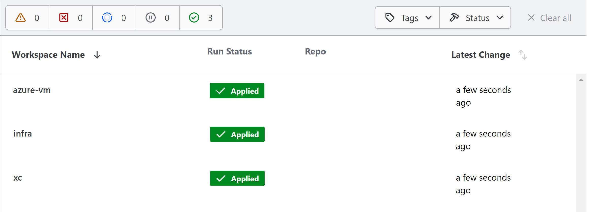
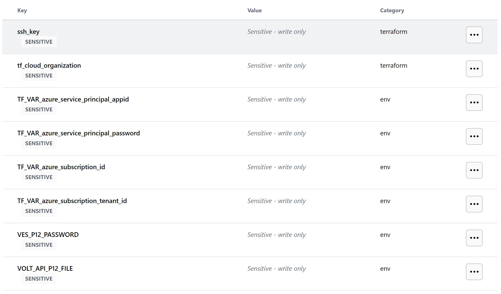
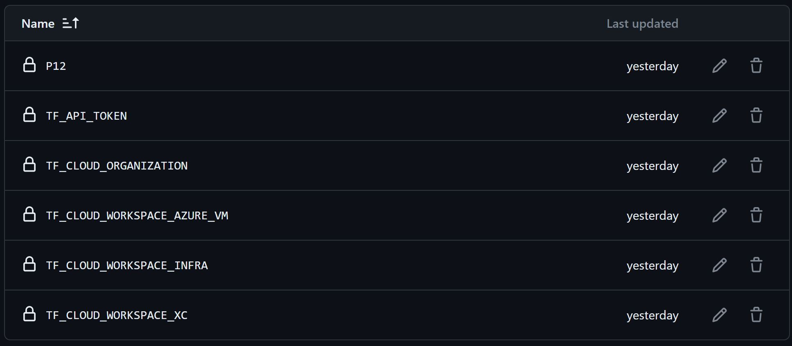
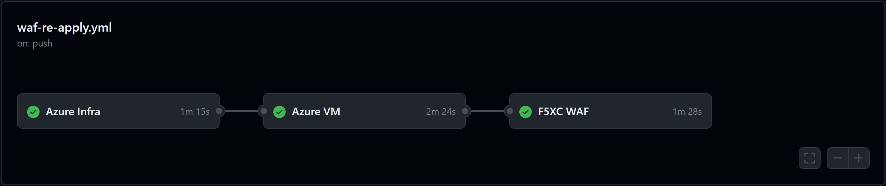
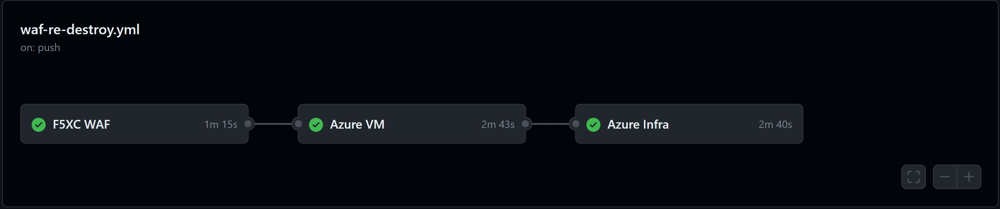

Getting Started With Terraform Automation
--------------------------------------------

Prerequisites
-------------

-  `F5 Distributed Cloud Account
   (F5XC) <https://console.ves.volterra.io/signup/usage_plan>`__

   -  `F5XC API Certificate <https://docs.cloud.f5.com/docs/how-to/user-mgmt/credentials>`__
   -  `Domain Delegation <https://docs.cloud.f5.com/docs/how-to/app-networking/domain-delegation>`__

-  `Azure Account <https://azure.microsoft.com/en-in/get-started/azure-portal/>`__
-  `Terraform Cloud
   Account <https://developer.hashicorp.com/terraform/tutorials/cloud-get-started>`__
-  `GitHub Account <https://github.com>`__

List of Products Used
-----------------------

-  **xc:** F5 Distributed Cloud WAF
-  **infra:** Azure Infrastructure (VM with NGINX image)
-  **arcadia:** Demo Application

Tools
-----

-  **Cloud Provider:** Azure
-  **IAC:** Terraform
-  **IAC State:** Terraform Cloud
-  **CI/CD:** GitHub Actions

Terraform Cloud
---------------

-  **Workspaces:** Create a CLI or API workspace for each asset in the
   workflow chosen as shown below.

   +---------------------------+-------------------------------------------+
   |         **Workflow**      |  **Assets/Workspaces**                    |
   +===========================+===========================================+
   | f5-xc-waf-on-re           | infra, azure-vm, xc                       |
   +---------------------------+-------------------------------------------+

-  **Workspace Sharing:** Under the settings for each Workspace, set the
   **Remote state sharing** to share with each Workspace created.

-  **Variable Set:** Create a Variable Set with the following values:

   +------------------------------------------+--------------+------------------------------------------------------+
   |         **Name**                         |  **Type**    |      **Description**                                 |
   +==========================================+==============+======================================================+
   | TF_VAR_azure_service_principal_appid     | Environment  |  Service Principal App ID                            |
   +------------------------------------------+--------------+------------------------------------------------------+
   | TF_VAR_azure_service_principal_password  | Environment  |  Service Principal Secret                            |
   +------------------------------------------+--------------+------------------------------------------------------+
   | TF_VAR_azure_subscription_id             | Environment  |  Your Subscription ID                                | 
   +------------------------------------------+--------------+------------------------------------------------------+
   | TF_VAR_azure_subscription_tenant_id      | Environment  |  Subscription Tenant ID                              |
   +------------------------------------------+--------------+------------------------------------------------------+
   | VES_P12_PASSWORD                         | Environment  |  Password set while creating F5XC API certificate    |
   +------------------------------------------+--------------+------------------------------------------------------+
   | VOLT_API_P12_FILE                        | Environment  |  Your F5XC API certificate. Set this to **api.p12**  |
   +------------------------------------------+--------------+------------------------------------------------------+
   | ssh_key                                  | TERRAFORM    |  Your ssh key for accessing the created resources    | 
   +------------------------------------------+--------------+------------------------------------------------------+
   | tf_cloud_organization                    | TERRAFORM    |  Your Terraform Cloud Organization name              |
   +------------------------------------------+--------------+------------------------------------------------------+ 

-  Variable set created in terraform cloud:

GitHub
------

-  Fork and Clone Repo. Navigate to ``Actions`` tab and enable it.

-  **Actions Secrets:** Create the following GitHub Actions secrets in
   your forked repo

   -  P12: The linux base64 encoded F5XC P12 certificate
   -  TF_API_TOKEN: Your Terraform Cloud API token
   -  TF_CLOUD_ORGANIZATION: Your Terraform Cloud Organization name
   -  TF_CLOUD_WORKSPACE\_\ *<Workspace Name>*: Create for each
      workspace in your workflow per each job

      -  EX: TF_CLOUD_WORKSPACE_AZURE_VM would be created with the
         value ``azure-vm``

-  Created GitHub Action Secrets:

Workflow Runs
-------------

**STEP 1:** Check out a branch with the branch name as suggested below for the workflow you wish to run using
the following naming convention.

**DEPLOY**

================ =======================
Workflow         Branch Name
================ =======================
f5-xc-waf-on-re  deploy-waf-re
================ =======================

Workflow File: `waf-re-apply.yml </.github/workflows/waf-re-apply.yml>`__

**DESTROY**

================ ========================
Workflow         Branch Name
================ ========================
f5-xc-waf-on-re  destroy-waf-re
================ ========================

Workflow File: `waf-re-destroy.yml </.github/workflows/waf-re-destroy.yml>`__

**STEP 2:** Rename ``azure/azure-infra/terraform.tfvars.examples`` to ``azure/azure-infra/terraform.tfvars`` and add the following data: 

-  project_prefix = “Your project identifier name in **lower case** letters only - this will be applied as a prefix to all assets”

-  azure_region = “Azure Region/Location” ex. "southeastasia"

-  Also update assets boolean value as per your workflow, here set azure-vm and vm_public_ip to true

**Step 3:** Rename ``xc/terraform.tfvars.examples`` to ``xc/terraform.tfvars`` and add the following data: 

-  api_url = “Your F5XC tenant” 

-  xc_tenant = “Your tenant id available in F5 XC ``Administration`` section ``Tenant Overview`` menu” 

-  xc_namespace = “The existing XC namespace where you want to deploy resources” 

-  app_domain = “the FQDN of your app (cert will be autogenerated)” 

-  xc_waf_blocking = “Set to true, to enable waf in blocking mode”

-  advertise_sites = "set to false if want to advertise on public"

Keep the rest of the values as they are.

**STEP 4:** Commit and push your build branch to your forked repo 

- Build will run and can be monitored in the GitHub Actions tab and TF Cloud console

**STEP 5:** Once the pipeline completes, verify your RE, Origin Pool and LB were deployed or destroyed based on your workflow. (**Note:** CE sites will take 15-20 mins to come online)

**STEP 6:** To validate the setup access the load balancer domain name to access Arcadia applicaiton.

**Note:** If you want to destroy the entire setup, checkout a new branch with name ``destroy-waf-re`` and push the repo code to it which will trigger destroy workflow to remove all created automation resources

