WAF on RE Step-by-Step Manual Deployment Process:
==================================================

Here are the steps to deploy the client application in Azure and load balancer in F5 Distributed Cloud. Also, it gives you information on how F5 XC is protecting the backend applications that are already public (accessible from the Internet via FQDN or public IP). 

1. Deploying Client Application (Arcadia Finance) in Azure 
************************************************************

Login to the Azure cloud and go to Virtual Machines. Click on the ``Create`` button.

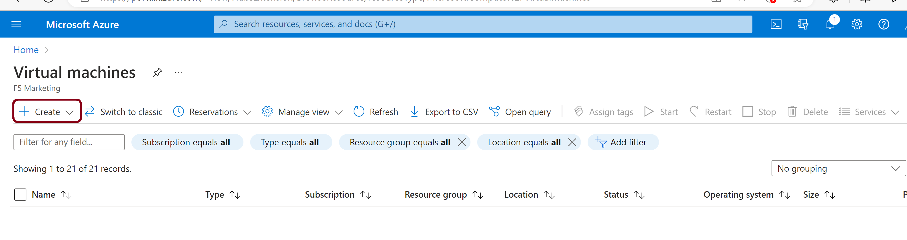

Give the below values to create the virtual machine. 

+---------------------------+------------------------------------------------------------------------------------------------------+
| Subscription details      | User Subscription Name                                                                               |
+---------------------------+------------------------------------------------------------------------------------------------------+
| Resource group            | Create a new one or select the existing one                                                          |
+---------------------------+------------------------------------------------------------------------------------------------------+
| Virtual machine name      | User choice (waapre-inst)                                                                            |
+---------------------------+------------------------------------------------------------------------------------------------------+
| Region                    | User choice                                                                                          |
+---------------------------+------------------------------------------------------------------------------------------------------+
| Image                     | Select Nginx Image from marketplace as we are deploying Arcadia application which requires the same. |
+---------------------------+------------------------------------------------------------------------------------------------------+
| Username                  | User choice (Demouser)                                                                               |
+---------------------------+------------------------------------------------------------------------------------------------------+
| Password                  | User choice                                                                                          |
+---------------------------+------------------------------------------------------------------------------------------------------+
| Selected inbound ports    | select HTTP (80), HTTPS (443), SSH (22), and 8080 as inbound ports                                   |
+---------------------------+------------------------------------------------------------------------------------------------------+

Click on ``Review+Create``  by making other configurations default.

Finally, click on the ``Create`` button, and then go to Resources.

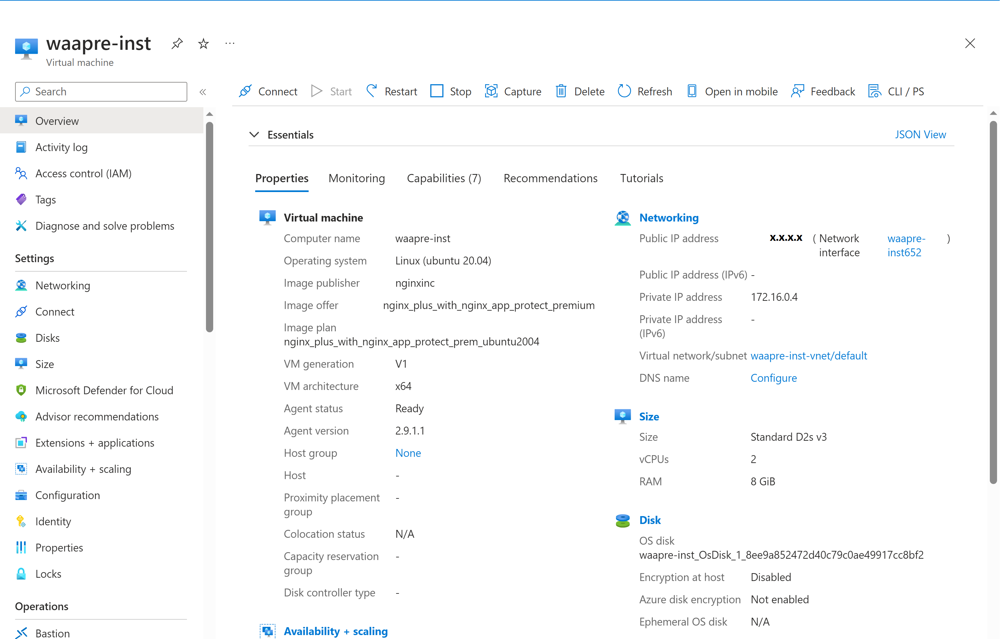

Access the VM instance using the public IP of the VM instance through SSH (22), and execute the below commands.

* Install Docker

  - snap install docker

* Install Arcadia using the below Docker commands.    
  
  - docker network create internal    
  - docker run -dit -h mainapp --name=mainapp --net=internal registry.gitlab.com/arcadia-application/main-app/mainapp:latest   
  - docker run -dit -h backend --name=backend --net=internal registry.gitlab.com/arcadia-application/back-end/backend:latest  
  - docker run -dit -h app2 --name=app2 --net=internal registry.gitlab.com/arcadia-application/app2/app2:latest  
  - docker run -dit -h app3 --name=app3 --net=internal registry.gitlab.com/arcadia-application/app3/app3:latest  
  - docker run -dit -h nginx --name=nginx --net=internal -p 8080:80 -v /home/Demouser/default.conf:/etc/nginx/conf.d/default.conf registry.gitlab.com/arcadia-application/nginx/nginxoss:latest  

* Finally verify that Arcadia is UP.  
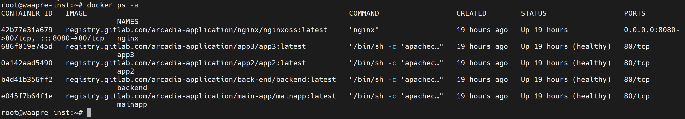

* Access the Arcadia application using IP 8080.
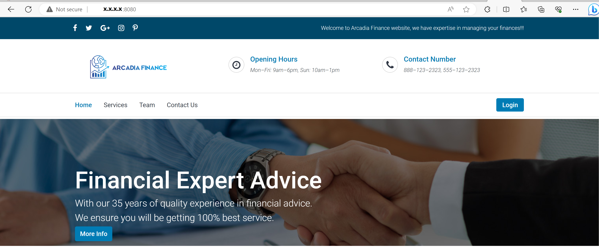

2. F5 XC Configuration
***********************

Creating an Origin Pool and WAF Policy:
****************************************
Log in to the F5 Distributed Cloud Console and navigate to ``Web App & API Protection``.

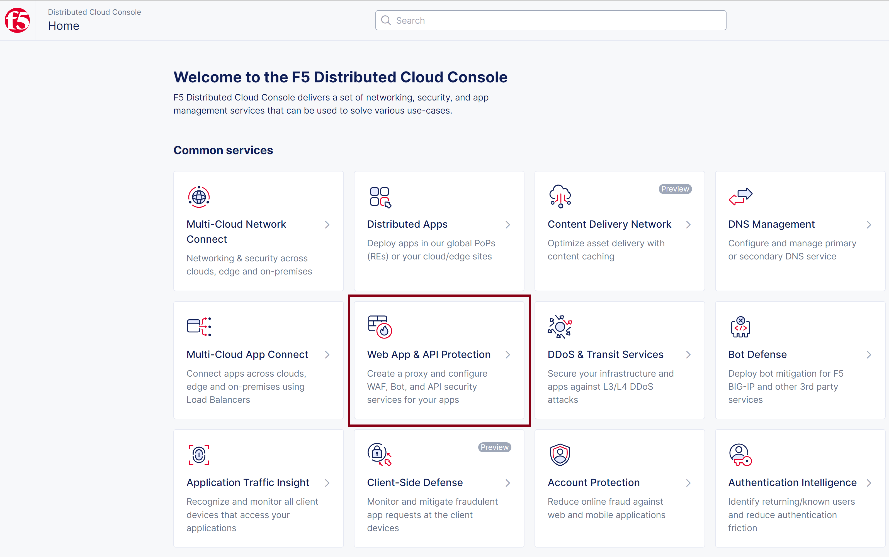

Navigate to ``Manage`` -> ``Load Balancers`` -> ``Origin Pools``  and click on ``Add Origin Pool``.

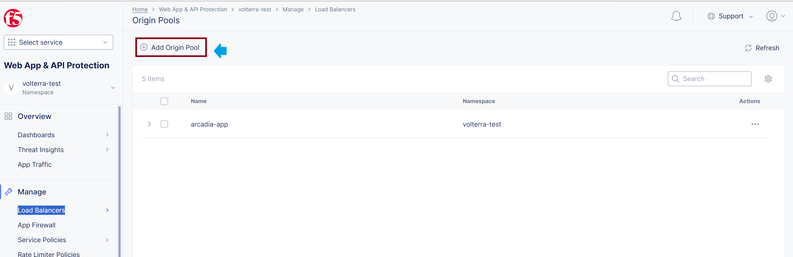

Give the Origin pool name (Arcadia-azure), the public IP (x.x.x.x) address, and the port (8080) details. Click on ``Save and Exit``.

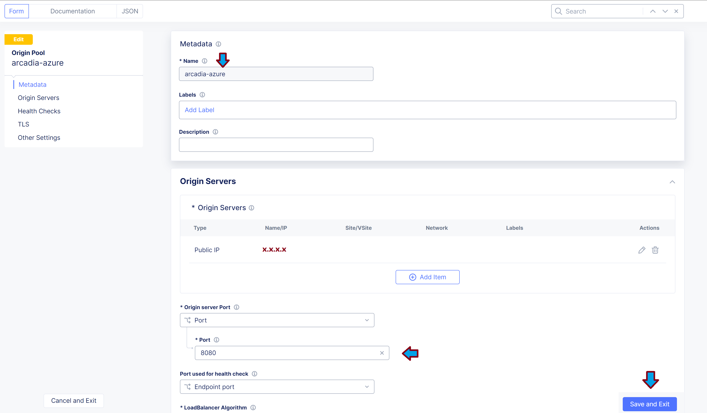

Verify that the Origin pool is created successfully with the name ``Arcadia-azure``.

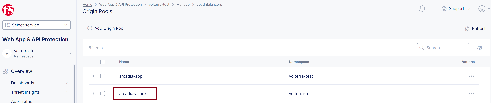

Go to ``Manage`` -> ``App Firewall`` and click on ``Add App Firewall``.

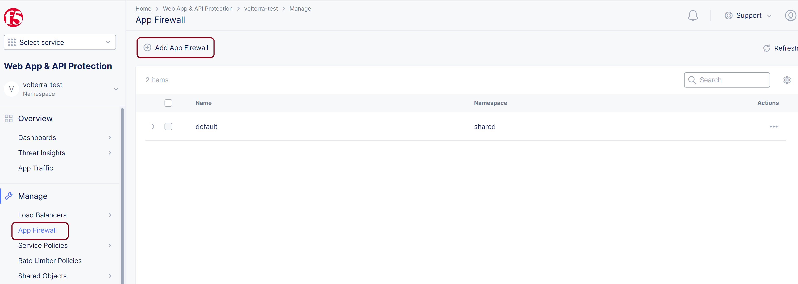

Give the firewall name as ``re-waf`` and select the Enforcement Mode as ``blocking``. Click on ``Save and Exit``.

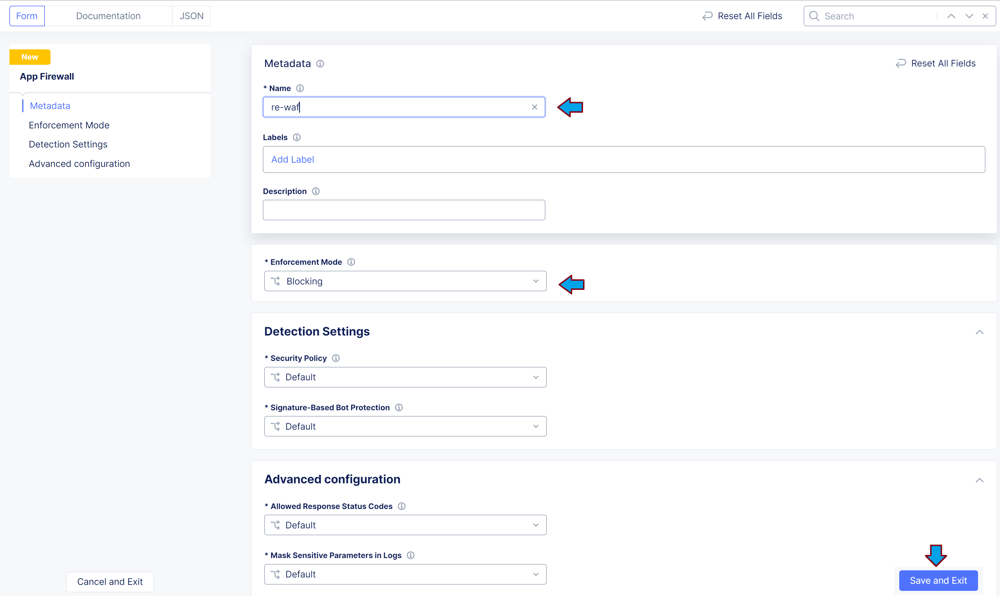

Verify that the APP Firewall is created successfully.

.. figure:: assets/waf-created.png

Creating a Load Balancer in F5 XC:
**********************************

Log in the F5 Distributed Cloud Console and navigate to ``Web App & API Protection``.

Click on ``Add HTTP Load Balancer``.

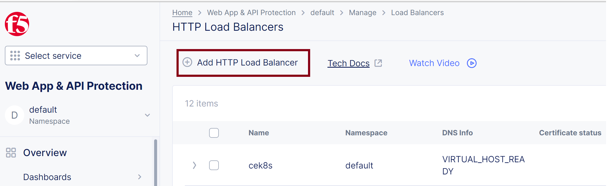

Enter LB name **waapre** , domain name **waap-re-test-f5.abc.com**, and select LB type **HTTPS with Automatic Certificate**.

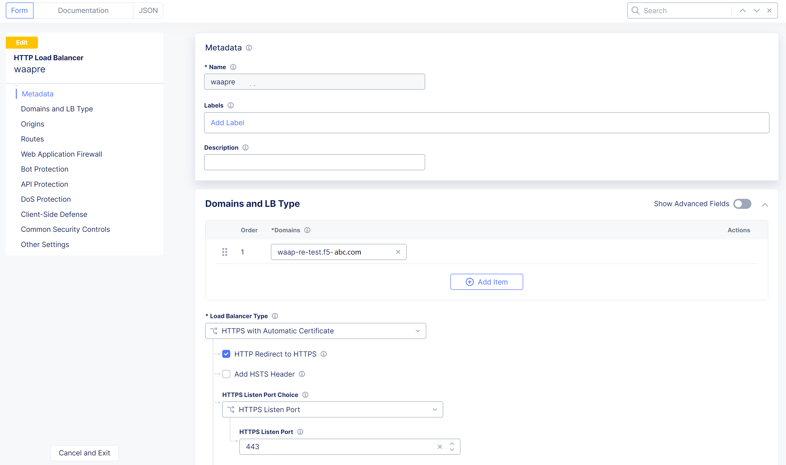

Associate the created origin pool **arcadia-azure** to LB, enable the WAF, and attach the WAF policy with enforcement mode as ``blocking``.

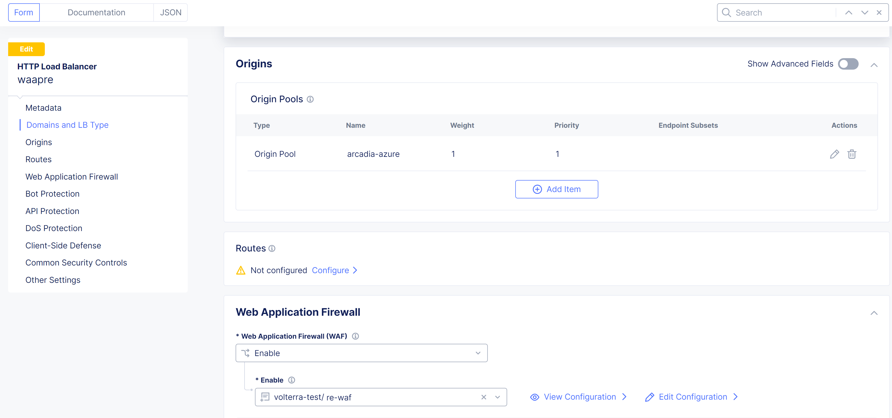

Click on ``Save and Exit``.

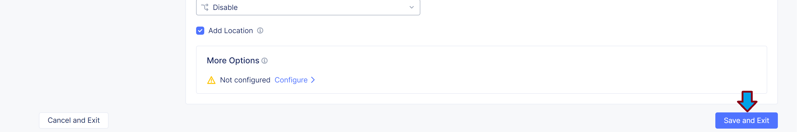

Verify that the zone was created successfully.

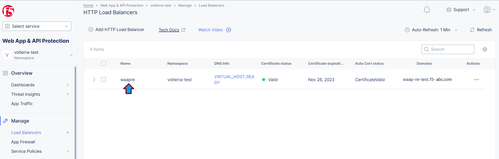

That's it! You have created the load balancer successfully!

3. Validation
**************
Now all the users can access the application on F5 XC through all the regional edges and it provides protection to the backend application based on the configured WAF policies.

With malicious attacks:
***********************
Click on Login button and send an sql-injection attack. 

.. figure:: assets/sql-inj.png

Verify that the sql injection is been detected and blocked by F5 XC WAAP.

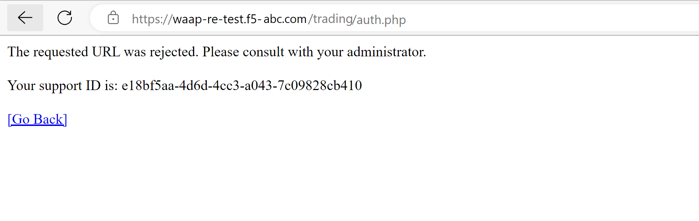

Conclusion
***********
As you can see, it takes just a few steps and inputs to deploy the application in cloud environments and to create the load balancer with WAF policies, which in the end keeps the backened application safe and secure and makes users and/or customers happy!
